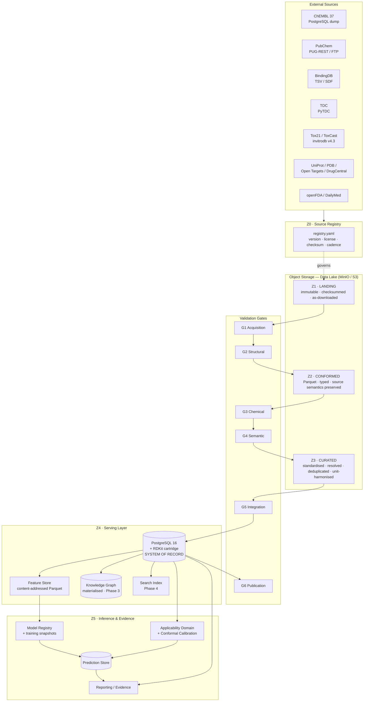
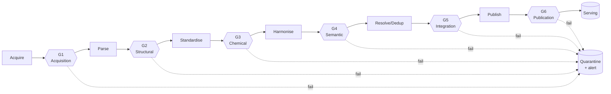

# DrugSim — Phase 1, Step 2
## Data Architecture & Reproducibility Design

**Document status:** Draft for approval
**Date:** 2026-08-05
**Depends on:** `step1-dataset-survey.md` (approved)
**Companion:** `step2-data-dictionary.md`, `datasets/registry.yaml`
**Blocks:** Step 3 (Relational Schema / ERD)

---

## 0. How Step 1 Constrains This Design

Architecture should follow from evidence, not from a reference diagram. Five verified findings from Step 1 drive nearly every decision below.

| Step 1 finding | Architectural consequence |
|---|---|
| ADMET corpus is **475–13,130 molecules per endpoint** [V] | **No distributed compute.** Single-node DuckDB/Polars is sufficient and dramatically more reproducible. Optimising for throughput would be solving a problem we do not have |
| **BindingDB is split-licensed internally** [V] | License provenance must be **per-record**, not per-dataset — a column, not a folder |
| ShareAlike runs through ChEMBL/DrugCentral/PharmGKB (§5.2 unresolved) | **License tier is a physical partition**, and every model records which tiers it consumed. "Can we ship this?" must be a SQL query |
| **TDC does not document units** (verified 2026-08-05 — both ADME and Tox pages omit units for most endpoints) | **Unit verification cannot be documentation-based.** It must be empirical, via distribution/range assertion. Gate G4 exists because of this |
| Small data + novel query molecules | **Applicability domain is a required output.** The prediction layer is designed around uncertainty, not around throughput |

The dominant risk in this system is **silent scientific error** — a unit misread, a leaked test compound, a stale license tag — not latency or scale. The architecture is therefore weighted toward validation, lineage and immutability, and deliberately austere on infrastructure.

---

## 1. Architectural Principles

**P1 — Reproducibility is a hard constraint.** Any prediction DrugSim has ever emitted must be reconstructible from recorded identifiers alone: model, feature set, training snapshot, toolchain. See §7.

**P2 — Raw data is immutable.** Landed bytes are never edited. Every correction is a forward transformation, replayable from source. Upstream sources mutate (ChEMBL re-curates, EPA re-fits curves); our copy of what they said on a given date must not.

**P3 — License tier is a first-class dimension**, enforced physically and carried per-record.

**P4 — Measurements and predictions never co-mingle.** Separate tables, separate lineage. An experimental Caco-2 value and a predicted one must be impossible to confuse by accident. This is the single most consequential modelling-integrity rule in the system.

**P5 — Chemical identity is layered, not singular.** One identifier cannot serve deduplication, stereochemistry, and leakage prevention simultaneously. See §5.

**P6 — Splits are global and assigned once.** Leakage is a cross-dataset property. Per-dataset splitting is insufficient. See §8.3.

**P7 — Prefer boring, inspectable technology.** Every added system is reproducibility surface area. Small data buys us the luxury of simplicity; we should spend it.

---

## 2. System Architecture



### 2.1 Why a lake at all, given the data is small?

Not for scale — for **replayability**. The scientific value of DrugSim rests on being able to answer "what did the data look like when this model was trained, and what changed since?" A direct source-to-Postgres pipeline destroys that: upstream re-curation silently overwrites history, and a bug found in the standardisation code cannot be re-run against the original bytes.

The lake costs perhaps two weeks of setup and buys permanent auditability. At this data volume it is cheap insurance; at regulatory-grade ambition (§Step 1 open question 3) it becomes mandatory.

---

## 3. Zone Specifications

License tiering (Green/Amber/Red/Black, per Step 1 §5.1) **cuts across every zone** as a partition key.

### Z0 — Source Registry
**Purpose:** declarative single source of truth for what DrugSim ingests. Nothing enters the lake without a registry entry. Version-controlled in git; changes are reviewed like code.

**Contents:** source id, upstream version, URL, retrieval method, SPDX license, license tier, commercial-use flag, attribution string, expected cadence, checksum of last acquisition, owner.

**Why it exists:** the licensing exposure in Step 1 §5 is unmanageable without a machine-readable manifest. It also drives freshness monitoring — a source that has missed its cadence (DrugCentral, per Step 1) surfaces automatically rather than being noticed years later.

### Z1 — Landing
**Format:** exactly as retrieved (SQL dumps, SDF, TSV, XML, Parquet). No parsing.
**Layout:** `z1-landing/{license_tier}/{source_id}/{snapshot_id}/{files}`
**Snapshot ID:** `{source_version}__{acquisition_date}__{sha256[:12]}`
**Rules:** write-once, read-many. Object-lock/versioning enabled. Never deleted without a retention decision.
**Why:** P2. This is the evidentiary base of the whole system.

### Z2 — Conformed
**Format:** Parquet (Snappy), one dataset per logical source table.
**Transformations permitted:** parsing, type coercion, encoding normalisation, column renaming to snake_case, addition of provenance columns.
**Transformations forbidden:** any semantic change — no unit conversion, no deduplication, no chemical standardisation, no null-filling.
**Why the strictness:** Z2 must remain a faithful, queryable mirror of the source. When a curated value looks wrong, Z2 is where you check whether we broke it or the source said it. Collapsing Z2 and Z3 destroys that diagnostic and is the most common mistake in pipelines of this kind.

### Z3 — Curated
Where science happens. Chemical standardisation, entity resolution, unit harmonisation, deduplication, ontology mapping. Fully specified in §8.

**Layout:** `z3-curated/{license_tier}/{entity}/{drugsim_release}/`

### Z4 — Serving
Three consumers with genuinely different access patterns, hence three stores (justified in §6):
- **PostgreSQL + RDKit cartridge** — system of record; transactional integrity, substructure/similarity search in SQL
- **Feature store** — content-addressed Parquet for training and inference
- **Knowledge graph** — materialised from Postgres; deferred to Phase 3 (ADR-004)

### Z5 — Inference & Evidence
Model registry, prediction store, applicability-domain/calibration service, reporting. Predictions are **evidence artefacts with provenance**, never facts (P4).

---

## 4. ETL Pipeline & Validation Gates

Six gates. Each is a **hard stop**: failure quarantines the batch and raises, rather than logging a warning and proceeding. Warn-and-continue is how bad data reaches models.



### G1 — Acquisition
Checksum vs. published (where available) · registry entry exists · license captured and unchanged since last run · file size within expected envelope · **license-change detection** (a source silently relicensing is a material event).

### G2 — Structural
Schema conformance vs. pinned expected schema · type coercion without silent loss · encoding/newline normalisation · row-count delta vs. previous snapshot within tolerance · primary-key uniqueness at source level.
*Rationale:* an unannounced upstream schema change should fail loudly, not silently null a column.

### G3 — Chemical
RDKit parse success · sanitisation success · valence/aromaticity checks · disconnected-fragment detection · isotope and radical flags · standardisation applied (§8.1) · **standardisation must be idempotent** (re-running yields identical output — asserted in CI).

### G4 — Semantic — *the gate TDC's missing documentation forces*
Because TDC does not publish units (verified 2026-08-05), unit correctness **cannot** be asserted from documentation. It is asserted empirically:

1. **Range assertion.** Observed min/max/median compared to a literature-expected envelope declared in the data dictionary. A logS array centred near −3 is plausible; one centred near −7 signals cm/s vs. log(cm/s) confusion or a mol/L vs. µg/mL error.
2. **Distribution shape.** Log-scaled quantities are approximately symmetric; raw-scaled ones are heavily right-skewed. Skewness discriminates them reliably.
3. **Cross-source triangulation.** Compounds present in both TDC and ChEMBL must agree within tolerance after conversion. Disagreement means a unit or standardisation error somewhere.
4. **Sign convention.** Endpoints where higher = worse (LD50 expressed as log(1/(mol/kg))) versus higher = better must be explicitly asserted, not inferred.

Also at G4: ontology mapping (MedDRA/EFO/MONDO/ChEBI/GO), controlled-vocabulary conformance, null-semantics resolution (not-measured vs. measured-as-zero vs. below-LOQ — three different things that must never collapse to `NULL`).

### G5 — Integration
Entity resolution to `compound_uid` / UniProt accession · cross-source deduplication (§8.2) · referential integrity · **per-record license tag present and valid** (fails hard if absent) · unit harmonisation to canonical units.

### G6 — Publication
**Leakage audit** — no `split_group` appears in both train and test across *any* pair of datasets (§8.3) · **license audit** — no Black-tier record in a commercial-path artefact · statistical drift vs. previous release · attribution manifest regenerated · release notes diffed.

### 4.1 Orchestration
**Dagster**, chosen for asset-oriented modelling (ADR-006). Each zone artefact is a declared *asset* with typed dependencies, so lineage is structural rather than documentation. Materialisation metadata (row counts, checksums, gate results) is captured automatically — which is precisely the provenance §7 requires.

---

## 5. Chemical Identity Model

A single identifier cannot serve every purpose, and choosing one is a common and costly error. DrugSim uses **four layers**, all stored.

| Layer | Field | Purpose | Notes |
|---|---|---|---|
| **Surrogate** | `compound_uid` | Immutable internal PK | Never reused, never derived from structure. Structure-derived PKs break when standardisation logic changes |
| **Exact** | `inchikey_full` (27) | Stereo- and isotope-specific identity | Deduplication of identical entities |
| **Parent** | `parent_inchikey` | Post salt/solvate stripping, charge-neutralised | Links salt forms to parent — the layer most bioactivity joins should use |
| **Skeleton** | `inchikey_skeleton` (first 14) | Connectivity only; stereochemistry-blind | **Leakage prevention** and stereoisomer grouping |

**Why `inchikey_full` must not be the primary key:**
- InChI does not fully normalise tautomers — tautomers of one substance receive different keys
- Standardisation choices (which counter-ion is a salt, how to neutralise) alter the key; the PK would change when our code changes, breaking every foreign key
- The 14-character skeleton block has known collision behaviour and is not unique
- Mixtures, polymers and inorganics are handled inconsistently

**Scaffold layer.** `bemis_murcko_scaffold` and `generic_scaffold` are computed and stored for split assignment (§8.3) and similarity analysis.

**Protein identity** resolves to **UniProt accession**, with `isoform_id` where relevant; Swiss-Prot only for ground truth (Step 1 §3.6). ChEMBL targets, BindingDB targets, PDB chains and Open Targets all map here.

---

## 6. Serving Layer

### 6.1 PostgreSQL + RDKit cartridge — system of record

Postgres is the authoritative store because DrugSim's core data is highly relational (compounds ↔ measurements ↔ assays ↔ targets ↔ documents), needs referential integrity, and — critically — must enforce the licence and measurement/prediction separation rules at constraint level rather than by convention.

The **RDKit PostgreSQL cartridge** is decisive: it puts substructure search (`@>`), Tanimoto similarity (`%`), and descriptor computation directly in SQL with GiST-indexed fingerprints. Without it, every structural query becomes an application-layer scan. With ~3M ChEMBL compounds this is the difference between milliseconds and minutes.

`JSONB` is used deliberately but narrowly — for genuinely heterogeneous payloads (raw assay metadata, model hyperparameters) — never for anything queried in a hot path or subject to referential integrity.

### 6.2 Feature store — content-addressed Parquet

**Rejected: Feast and similar.** Feature stores solve online/offline skew at scale with high-cardinality entities and streaming freshness. DrugSim has none of those problems: features are deterministic pure functions of a standardised structure, and the entity count is ~10⁶.

**Adopted:** immutable Parquet keyed by `compound_uid`, addressed by

```
feature_set_id = sha256(
    descriptor_spec_version ||
    rdkit_version ||
    standardization_pipeline_version ||
    sorted(descriptor_names)
)
```

**Why content addressing matters more than convenience: RDKit descriptor values change between releases.** Bug fixes to TPSA, logP contributions and aromaticity perception mean features computed under RDKit 2024.03 are not interchangeable with 2025.09. If `rdkit_version` is not part of the feature identity, models silently drift and results become irreproducible. This is a real, frequently-encountered failure, not a theoretical one.

**Training/serving skew** is prevented structurally: one descriptor library, invoked identically by the training pipeline and the inference path, with `feature_set_id` recorded on every prediction. A mismatch between a model's training `feature_set_id` and the serving one is a hard error, not a warning.

### 6.3 Knowledge graph — materialised, deferred

Deferred to Phase 3 and derived from Postgres rather than maintained as a parallel primary store (ADR-004). Rationale in §Step 1 terms: the KG's value is in multi-hop traversal (compound → protein → pathway → disease), which is a Phase 3+ capability, and two writable stores means two sources of truth and a synchronisation problem we have no reason to accept yet. Recursive CTEs in Postgres cover 2–3 hop queries adequately at this scale.

---

## 7. Versioning & Provenance Strategy

### 7.1 The reproducibility contract

> Every prediction record carries sufficient identifiers to reconstruct, byte-for-byte, the data and code that produced it.

Seven independently versioned axes:

| Axis | Identifier | Example |
|---|---|---|
| Upstream source version | `source_version` | `chembl_37` |
| Our acquisition | `snapshot_id` | `chembl_37__2026-06-14__a3f9c21b8e40` |
| ETL code | `pipeline_version` | git SHA |
| Toolchain | `toolchain_id` | `rdkit-2026.03.1__python-3.12.4` |
| Curated release | `drugsim_release` | `core-db-v1.2.0` (SemVer) |
| Feature set | `feature_set_id` | content hash (§6.2) |
| Model | `model_version` + `training_snapshot_id` | `admet-caco2-v0.3.1` |

### 7.2 Semantic versioning for the Core DB
- **MAJOR** — breaking schema change, or a curation change that alters existing values
- **MINOR** — new sources, new fields, additive rows
- **PATCH** — corrections that do not change schema or existing semantics

**Rule:** an upstream refresh that changes existing values is a MAJOR bump, even though "just refreshing ChEMBL" feels routine. Models trained on the prior release are not valid against the new one without re-validation, and the version number should say so.

### 7.3 Provenance carried per-record
Every fact-bearing row carries `source_id`, `source_version`, `source_record_id`, `source_license`, `license_tier`, `ingested_at`, `pipeline_version`, `snapshot_id`. Costly in bytes, non-negotiable in practice: Step 1 verified that BindingDB is split-licensed internally, so a dataset-level tag is provably insufficient.

### 7.4 What "reproducible" excludes
Honesty about limits: we can reproduce *our* processing exactly. We **cannot** reproduce upstream sources — ChEMBL does not guarantee old releases remain downloadable, and PubChem is continuously mutable. That is precisely why Z1 landing snapshots are retained permanently. Our Z1 copy *is* the reproducibility guarantee, and its retention policy is therefore a scientific requirement, not a storage-cost decision.

---

## 8. Curation Specification (Z2 → Z3)

### 8.1 Chemical standardisation
Pipeline, applied in fixed order, version-pinned, idempotent:

1. Parse & sanitise (RDKit)
2. Normalise functional groups (ChEMBL Structure Pipeline conventions — nitro, azide, sulfoxide representations)
3. Remove explicit hydrogens; re-perceive aromaticity
4. Strip salts/solvates against a curated salt list → `parent_structure`
5. Neutralise charges where chemically sensible
6. Select canonical tautomer (RDKit `TautomerEnumerator`) → **recorded as a separate field, not overwriting the source structure**
7. Handle stereochemistry: preserve as given; flag undefined centres in `stereo_completeness`
8. Compute the four identity layers (§5)

**Both the original and standardised structures are retained.** Standardisation is lossy and its conventions are debatable; discarding the source structure makes disagreements unresolvable.

### 8.2 Deduplication
- **Within source:** exact `inchikey_full` match → merge, retain all source record IDs
- **Across sources (ChEMBL ↔ BindingDB especially):** match on `parent_inchikey` + target accession + endpoint type. Step 1 flagged this as mandatory — the overlap is large, and double-counting both inflates apparent data volume and leaks between splits
- **Conflicting measurements are not averaged.** All values are retained as separate measurement rows with source attribution; aggregation is a modelling decision made downstream and recorded, never silently baked into the curated layer

### 8.3 Global split assignment — leakage prevention

This is the design decision most likely to be skipped and most likely to invalidate published results.

**The failure mode:** per-dataset scaffold splitting (TDC's default) is correct *within* a dataset. It does nothing across datasets. If a scaffold is in Caco-2 train and DILI test, then any multi-task model, pretrained encoder, or transferred representation leaks — and reported DILI performance is optimistic. With 475-compound datasets (Step 1), a handful of leaked scaffolds materially moves the metric.

**The design:**
- A single global `split_group` is assigned **once**, at Bemis-Murcko scaffold level, over the union of all compounds in the Core DB
- Assignment is deterministic: `hash(scaffold_smiles || split_salt) mod N`
- Stored in a `compound_split_assignment` table; every dataset's split derives from it
- **Never recomputed.** Recomputation on a changed compound set silently reshuffles group membership and destroys comparability across model versions
- TDC's canonical splits are retained *in parallel* for benchmark comparability, clearly labelled as benchmark-only and unsuitable for internal cross-dataset claims

**Trade-off, stated plainly:** global splitting produces less favourable and less comparable-to-leaderboard numbers than per-dataset splitting. That is the point. It also slightly reduces usable training data where scaffold families are unevenly distributed. Both costs are worth paying for metrics that survive scrutiny.

### 8.4 Null semantics
Three distinct states, never collapsed:
- `NULL` + `status='not_measured'`
- `NULL` + `status='below_loq'` + `loq_value`, `loq_unit`
- `0` + `status='measured'`

Censored data (`>`, `<` relations, common in IC50 and LD50) is preserved with an explicit `value_relation` field. Discarding censoring — or worse, treating `>10000 nM` as `10000 nM` — is a routine and serious source of bias in ADMET modelling.

---

## 9. Prediction Layer Design

Per Step 1 §5.5, DrugSim is positioned as **prioritisation and triage**. The prediction layer must make that honest rather than rhetorical.

Every prediction record carries:

| Component | Purpose |
|---|---|
| Point estimate + `value_unit` | The prediction |
| **Prediction interval** (conformal) | Statistically valid coverage, not a heuristic score |
| **Applicability domain verdict** | in-domain / borderline / out-of-domain |
| AD evidence | max Tanimoto to training set, k-NN distance, scaffold-seen flag |
| Calibrated confidence | Post-hoc calibrated, with the calibration set identified |
| `model_version`, `feature_set_id`, `training_snapshot_id` | Reproducibility |
| Supporting evidence links | Nearest training neighbours with their measured values |
| `quality_score` | Composite, formula versioned |

**Conformal prediction is recommended** as the primary uncertainty method: it provides distribution-free, finite-sample validity under exchangeability, which suits datasets of a few hundred compounds far better than ensemble variance or dropout heuristics. It also degrades honestly — out-of-domain molecules yield wide intervals rather than confident nonsense.

**Design rule:** an out-of-domain verdict must be structurally impossible to suppress in the API contract or report template. The most likely commercial failure mode for DrugSim is not a wrong prediction; it is a wrong prediction presented without its caveat.

---

## 10. Architecture Decision Records

Condensed ADR format: Context · Decision · Alternatives · Consequences.

### ADR-001 — Lakehouse with immutable landing, over direct source→RDBMS
**Context:** Upstream sources mutate; reproducibility is a hard requirement.
**Decision:** Immutable Z1 landing on object storage; Postgres is derived, not primary-ingested.
**Alternatives:** Direct-to-Postgres (simpler, ~2 weeks faster); lake + warehouse SaaS (cost, vendor lock-in).
**Consequences:** + Full replayability, auditability, regulatory path. − Extra hop, ~2 weeks setup, storage cost. **Accepted:** replayability is the product's scientific credibility.

### ADR-002 — Single-node DuckDB + Polars, no Spark
**Context:** Largest artefacts are ChEMBL (~5.4 GB SQLite) and invitrodb; ADMET sets are ≤13k rows.
**Decision:** DuckDB for analytical SQL over Parquet; Polars for dataframe transforms.
**Alternatives:** Spark/Databricks (unjustified complexity, non-deterministic shuffles complicate reproducibility); pandas (memory-inefficient, weaker typing).
**Consequences:** + Radically simpler, deterministic, laptop-reproducible, no cluster ops. − Ceiling around single-machine RAM. **Accepted:** revisit only if a genuine >100 GB workload appears. Do not pre-build for scale we do not have.

### ADR-003 — PostgreSQL 16 + RDKit cartridge as system of record
**Context:** Highly relational data; substructure/similarity search is a core capability; constraints must be enforceable.
**Decision:** Postgres with the RDKit extension.
**Alternatives:** MongoDB (no referential integrity — disqualifying given per-record license and FK requirements); MySQL (no cartridge); pure lake (no transactional integrity).
**Consequences:** + Chemical search in SQL, mature ecosystem, strong constraints. − Cartridge adds an operational dependency and constrains managed-Postgres options (RDS does not ship it; Aurora/Cloud SQL likewise — self-managed or a container is required). **Accepted:** the capability is worth the ops cost.

### ADR-004 — Defer Neo4j; materialise the KG from Postgres in Phase 3
**Context:** Step 9 requires a KG; multi-hop traversal is a later-phase capability.
**Decision:** Model KG-shaped relations in Postgres now; materialise into Neo4j in Phase 3 as a derived read-only projection.
**Alternatives:** Neo4j as primary (dual sources of truth, sync burden); RDF/SPARQL (superior semantics and ontology alignment, materially steeper operational and skills cost); never (loses genuine multi-hop value).
**Consequences:** + One source of truth; no premature complexity; recursive CTEs cover 2–3 hops. − Deep traversal queries are awkward until Phase 3. **Accepted.** Revisit if traversal depth >3 becomes a routine product need.

### ADR-005 — Content-addressed Parquet feature store, not Feast
**Context:** Features are deterministic functions of structure; ~10⁶ entities; no streaming.
**Decision:** Immutable Parquet keyed by `compound_uid`, addressed by hash of descriptor spec + RDKit version + pipeline version.
**Alternatives:** Feast (solves problems we do not have; adds a registry service); recompute-on-demand (fast enough, but not reproducible across RDKit versions).
**Consequences:** + Exact reproducibility across toolchain upgrades; trivially inspectable. − Bespoke code to maintain; storage duplication across feature-set versions (acceptable at this scale). **Accepted.**

### ADR-006 — Dagster over Airflow
**Context:** Lineage and provenance are first-class requirements.
**Decision:** Dagster, using software-defined assets.
**Alternatives:** Airflow (task-oriented; lineage must be bolted on and documented separately); Prefect (good ergonomics, weaker asset lineage); shell scripts + Make (no lineage, no observability).
**Consequences:** + Lineage is structural; materialisation metadata captured automatically; strong local testing. − Smaller ecosystem than Airflow; team learning curve. **Accepted:** asset-orientation maps directly onto §7.

### ADR-007 — License tier as physical partition + per-record tag
**Context:** Unresolved ShareAlike exposure (Step 1 §5.2); BindingDB split-licensed internally [V].
**Decision:** Partition every zone by `license_tier`; carry `source_license` per record; record consumed tiers on every model.
**Alternatives:** Per-dataset tagging (provably insufficient); ignore until legal review (unacceptable — retrofitting is extremely costly).
**Consequences:** + "Is this model commercially shippable?" becomes a query; Green/Amber-only fallback training is mechanical. − Partition complexity; some duplication. **Accepted.**

### ADR-008 — Layered chemical identity; surrogate PK
**Context:** No single identifier serves dedup, stereochemistry and leakage prevention.
**Decision:** Surrogate `compound_uid` PK; four stored identity layers (§5).
**Alternatives:** InChIKey as PK (breaks when standardisation changes; tautomer-blind); SMILES as PK (not canonical across toolkits — disqualifying).
**Consequences:** + Stable FKs; correct semantics per use case. − More columns; joins must choose the right layer deliberately (documented in the dictionary). **Accepted.**

### ADR-009 — Global, once-assigned split groups
**Context:** Cross-dataset leakage with 475–13k-compound sets (Step 1 [V]).
**Decision:** Global scaffold-level `split_group`, assigned once, stored, never recomputed. TDC splits retained in parallel, benchmark-only.
**Alternatives:** Per-dataset splits (leaks across datasets); random splits (badly optimistic for novel chemistry).
**Consequences:** + Defensible internal metrics. − Lower headline numbers than leaderboards; slight data loss. **Accepted:** see §8.3.

### ADR-010 — Plain Parquet + manifest versioning now; Iceberg as a migration path
**Context:** Table-format wars; small data; reproducibility need already met by immutable snapshots.
**Decision:** Plain Parquet with explicit versioned partitions and a JSON manifest per release.
**Alternatives:** Apache Iceberg / Delta Lake (time travel, ACID, schema evolution — genuinely useful, but operationally heavier than warranted today).
**Consequences:** + Minimal dependencies; DuckDB reads natively. − Manual manifest discipline; no free time-travel. **Accepted**, with an explicit migration trigger: adopt Iceberg when concurrent writers or >50 curated tables appear.

### ADR-011 — MinIO in dev, S3-compatible in production
**Decision:** S3 API everywhere; MinIO locally and for self-hosted, cloud object storage in production.
**Consequences:** + Identical code paths dev↔prod; no lock-in. − MinIO ops burden if self-hosted at scale. **Accepted.**

### ADR-012 — Harmonise units at G5; retain source values verbatim
**Context:** TDC units undocumented [V]; unit errors are silent and severe.
**Decision:** Every measurement stores `source_value`/`source_unit` *and* `canonical_value`/`canonical_unit`, plus the `conversion_factor` applied.
**Alternatives:** Convert in place (destroys the audit trail); store source only (pushes conversion into every consumer — the classic route to inconsistent science).
**Consequences:** + Conversions auditable and correctable without re-ingestion. − Column duplication. **Accepted.** Note the LD50 case: converting log(1/(mol/kg)) → mg/kg requires molecular weight, so the *choice of MW* (salt vs. parent) is itself a recorded provenance decision.

---

## 11. Deferred Decisions

Deliberately unresolved, with triggers:

| Decision | Deferred until | Trigger |
|---|---|---|
| Neo4j adoption | Phase 3 | Routine >3-hop traversal need |
| Vector DB (similarity/RAG) | Phase 4 | AI Assistant module begins; RDKit GiST covers structural similarity until then |
| Elasticsearch | Phase 4 | Full-text search over DailyMed corpus |
| Iceberg migration | — | Concurrent writers or >50 curated tables |
| Redis caching | Phase 5 | Measured latency problem — not before |
| Distributed compute | — | Genuine >100 GB single workload |

Each of these is a real capability with a real cost. None is justified by evidence available today, and adding them speculatively would trade reproducibility for architecture-diagram completeness.

---

## 12. Open Items Carried Into Step 3

1. **Legal opinion on ShareAlike** (Step 1 §5.2) — architecture is outcome-agnostic; models are not. Needed before Phase 3.
2. **Regulatory ambition** (Step 1 open question 3) — if 21 CFR Part 11 is in scope, audit-trail tables must enter the Step 3 ERD, not be retrofitted.
3. **PubChem / DailyMed figure re-verification** on an unfiltered network.
4. **Empirical unit determination** for all TDC endpoints via G4 — the expected envelopes in the data dictionary are literature-derived and explicitly marked provisional.

---

*End Step 2 (architecture). Companion: `step2-data-dictionary.md`. Awaiting approval before Step 3 (ERD & relational schema).*
