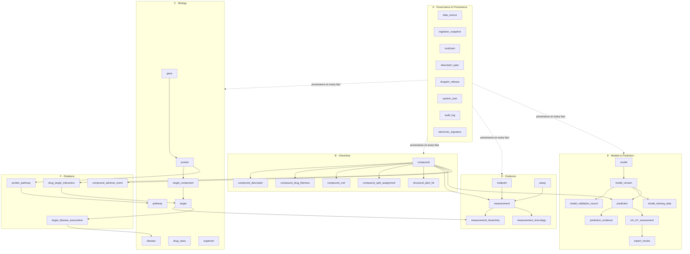

# DrugSim — Phase 1, Step 3
## Normalized Relational Schema (ERD, Tables, Keys, Constraints, Indexes)

**Document status:** Draft for approval
**Date:** 2026-08-05
**Target:** PostgreSQL 16 + RDKit cartridge (ADR-003)
**Depends on:** Step 1 survey · Step 2 architecture · Step 2 data dictionary · Step 2 regulatory addendum
**Scope:** Schema definition only. No application code, no models, no API.

---

## 0. Design Rules

Seven rules govern every table below. Each traces to an earlier decision.

| # | Rule | Origin |
|---|---|---|
| R1 | **Surrogate ULID primary keys everywhere.** Natural keys (InChIKey, accession) are unique-constrained but never PKs | ADR-008 — structure-derived PKs break when standardisation changes |
| R2 | **Descriptors live in a versioned side table, not on `compound`** | ADR-005 — RDKit version changes descriptor values; multiple versions must coexist |
| R3 | **Measurements and predictions are structurally separated**, enforced by CHECK constraints | P4 |
| R4 | **`license_tier` is denormalised onto fact tables** and used as a partition key | ADR-007 — deliberate 3NF violation, justified in §11.2 |
| R5 | **No `ON DELETE CASCADE` anywhere. No hard deletes.** All FKs are `RESTRICT`; removal is `is_deleted = TRUE` + audit entry | P8 / 21 CFR Part 11 |
| R6 | **Every unit-bearing value stores source and canonical forms** with the conversion recorded | ADR-012 |
| R7 | **Supertype/subtype for measurements** — shared attributes in `measurement`, domain-specific in disjoint extension tables | §11.1 |

---

## 1. Domain Map



---

## 2. Shared Types & Domains

Domains centralise reusable constraints so a rule is defined once and cannot drift between tables.

```sql
-- ---------- Domains ----------
CREATE DOMAIN ulid          AS CHAR(26)
    CHECK (VALUE ~ '^[0-9A-HJKMNP-TV-Z]{26}$');

CREATE DOMAIN inchikey27    AS CHAR(27)
    CHECK (VALUE ~ '^[A-Z]{14}-[A-Z]{10}-[A-Z]$');

CREATE DOMAIN inchikey14    AS CHAR(14)
    CHECK (VALUE ~ '^[A-Z]{14}$');

CREATE DOMAIN uniprot_acc   AS VARCHAR(10)
    CHECK (VALUE ~ '^[OPQ][0-9][A-Z0-9]{3}[0-9]([A-Z0-9]{4}[0-9])?$'
        OR VALUE ~ '^[A-NR-Z][0-9]([A-Z][A-Z0-9]{2}[0-9]){1,2}$');

CREATE DOMAIN prob_unit     AS NUMERIC(6,5)  CHECK (VALUE BETWEEN 0 AND 1);
CREATE DOMAIN sha256_hex    AS CHAR(64)      CHECK (VALUE ~ '^[a-f0-9]{64}$');
CREATE DOMAIN git_sha       AS CHAR(40)      CHECK (VALUE ~ '^[a-f0-9]{40}$');
CREATE DOMAIN semver        AS TEXT          CHECK (VALUE ~ '^\d+\.\d+\.\d+$');

-- ---------- Enums ----------
CREATE TYPE license_tier_t   AS ENUM ('green','amber','red','black');
CREATE TYPE meas_status_t    AS ENUM ('measured','not_measured','below_loq',
                                      'above_loq','inconclusive','withdrawn_by_source');
CREATE TYPE value_relation_t AS ENUM ('=','<','<=','>','>=','~');
CREATE TYPE evidence_type_t  AS ENUM ('experimental','predicted','derived',
                                      'expert_curated','text_mined','inferred_by_homology');
CREATE TYPE ad_verdict_t     AS ENUM ('in_domain','borderline','out_of_domain','undeterminable');
CREATE TYPE stereo_state_t   AS ENUM ('fully_defined','partially_defined','undefined','not_applicable');
CREATE TYPE endpoint_class_t AS ENUM ('absorption','distribution','metabolism','excretion',
                                      'toxicity','physicochemical','bioactivity');
CREATE TYPE audit_op_t       AS ENUM ('insert','update','soft_delete','restore');
CREATE TYPE sig_meaning_t    AS ENUM ('authorship','review','approval','responsibility','verification');
CREATE TYPE methodology_t    AS ENUM ('expert_rule_based','statistical_based','hybrid','read_across');
CREATE TYPE ich_m7_class_t   AS ENUM ('class_1','class_2','class_3','class_4','class_5');
CREATE TYPE oecd_principle_t AS ENUM ('defined_endpoint','unambiguous_algorithm','applicability_domain',
                                      'performance_measures','mechanistic_interpretation');
CREATE TYPE review_outcome_t AS ENUM ('confirms_prediction','overrides_prediction',
                                      'inconclusive_further_testing_required');
```

**Why domains over repeated CHECKs:** a ULID regex written into forty tables will diverge. A domain is declared once, and altering it propagates. This matters more in a validated system, where a constraint change is itself a controlled event.

---

## 3. Domain A — Governance & Provenance

### 3.1 `data_source`
Mirror of `registry.yaml`, loaded at deploy. The registry is authoritative; this table is its queryable projection.

```sql
CREATE TABLE data_source (
    source_id           TEXT          PRIMARY KEY,
    name                TEXT          NOT NULL,
    homepage            TEXT          NOT NULL,
    role                TEXT          NOT NULL,
    license_spdx        TEXT          NOT NULL,
    license_tier        license_tier_t NOT NULL,
    is_commercial_ok    BOOLEAN       NOT NULL,
    has_sharealike      BOOLEAN       NOT NULL,
    attribution_text    TEXT          NOT NULL,
    cadence_days        INTEGER       CHECK (cadence_days > 0),
    is_split_licensed   BOOLEAN       NOT NULL DEFAULT FALSE,
    verification_status TEXT          NOT NULL
        CHECK (verification_status IN ('verified','secondary','unverified')),
    verification_date   DATE          NOT NULL,
    notes               TEXT,
    CONSTRAINT ck_tier_commercial
        CHECK ((license_tier = 'black') = (is_commercial_ok = FALSE)),
    CONSTRAINT ck_tier_sharealike
        CHECK ((license_tier = 'red') = has_sharealike)
);
```

`ck_tier_commercial` and `ck_tier_sharealike` make the §C.2 mapping impossible to violate. Note `is_split_licensed` — set `TRUE` for BindingDB, whose per-record licence differs from its source-level one (Step 1 [V]).

### 3.2 `ingestion_snapshot`
```sql
CREATE TABLE ingestion_snapshot (
    snapshot_id       TEXT         PRIMARY KEY,
    source_id         TEXT         NOT NULL REFERENCES data_source(source_id) ON DELETE RESTRICT,
    source_version    TEXT         NOT NULL,
    acquired_at       TIMESTAMPTZ  NOT NULL,
    content_sha256    sha256_hex   NOT NULL,
    byte_size         BIGINT       NOT NULL CHECK (byte_size > 0),
    record_count      BIGINT       CHECK (record_count >= 0),
    landing_uri       TEXT         NOT NULL,
    license_at_time   TEXT         NOT NULL,
    gate_results      JSONB        NOT NULL DEFAULT '{}'::jsonb,
    is_superseded     BOOLEAN      NOT NULL DEFAULT FALSE,
    CONSTRAINT uq_snapshot UNIQUE (source_id, source_version, content_sha256)
);
CREATE INDEX ix_snapshot_source_time ON ingestion_snapshot (source_id, acquired_at DESC);
```

`license_at_time` is stored separately from `data_source.license_spdx` deliberately: it records what the licence *was* when we acquired the bytes. A source that relicenses does not retroactively change the terms under which we hold an existing snapshot, and gate LC-04 diffs these two.

### 3.3 `toolchain` and `descriptor_spec`
```sql
CREATE TABLE toolchain (
    toolchain_id      TEXT   PRIMARY KEY,
    rdkit_version     TEXT   NOT NULL,
    python_version    TEXT   NOT NULL,
    std_pipeline_ver  TEXT   NOT NULL,
    container_digest  TEXT,
    created_at        TIMESTAMPTZ NOT NULL DEFAULT now()
);

CREATE TABLE descriptor_spec (
    descriptor_spec_version TEXT PRIMARY KEY,
    toolchain_id      TEXT   NOT NULL REFERENCES toolchain(toolchain_id) ON DELETE RESTRICT,
    hbd_convention    TEXT   NOT NULL CHECK (hbd_convention IN ('lipinski','strict')),
    hba_convention    TEXT   NOT NULL CHECK (hba_convention IN ('lipinski','strict')),
    rotb_strict       BOOLEAN NOT NULL,
    descriptor_list   TEXT[] NOT NULL,
    feature_set_id    sha256_hex NOT NULL UNIQUE,
    created_at        TIMESTAMPTZ NOT NULL DEFAULT now()
);
```

`hbd_convention`/`hba_convention` exist because of the trap in dictionary §E.1: RDKit's two definitions disagree, which changes Lipinski verdicts. Recording the convention makes a drug-likeness call reproducible; omitting it makes it unfalsifiable.

### 3.4 `system_user`, `audit_log`, `electronic_signature`
Part 11 core. `audit_log` is append-only and monthly-partitioned.

```sql
CREATE TABLE system_user (
    user_uid      ulid PRIMARY KEY,
    username      TEXT NOT NULL UNIQUE,
    full_name     TEXT NOT NULL,
    email         TEXT NOT NULL,
    role          TEXT NOT NULL CHECK (role IN ('admin','curator','scientist','reviewer','service','readonly')),
    is_active     BOOLEAN NOT NULL DEFAULT TRUE,
    created_at    TIMESTAMPTZ NOT NULL DEFAULT now(),
    deactivated_at TIMESTAMPTZ,
    CONSTRAINT ck_user_deactivation CHECK (is_active OR deactivated_at IS NOT NULL)
);

CREATE TABLE audit_log (
    audit_uid     ulid        NOT NULL,
    occurred_at   TIMESTAMPTZ NOT NULL DEFAULT now(),
    table_name    TEXT        NOT NULL,
    record_pk     TEXT        NOT NULL,
    operation     audit_op_t  NOT NULL,
    old_values    JSONB,
    new_values    JSONB,
    changed_by    ulid        NOT NULL REFERENCES system_user(user_uid) ON DELETE RESTRICT,
    change_reason TEXT        NOT NULL,
    pipeline_version git_sha,
    PRIMARY KEY (audit_uid, occurred_at),
    CONSTRAINT ck_audit_values CHECK (
        (operation = 'insert'      AND old_values IS NULL     AND new_values IS NOT NULL) OR
        (operation = 'update'      AND old_values IS NOT NULL AND new_values IS NOT NULL) OR
        (operation IN ('soft_delete','restore') AND old_values IS NOT NULL)
    )
) PARTITION BY RANGE (occurred_at);

REVOKE UPDATE, DELETE ON audit_log FROM PUBLIC;

CREATE TABLE electronic_signature (
    signature_uid    ulid PRIMARY KEY,
    signed_table     TEXT NOT NULL,
    signed_record_pk TEXT NOT NULL,
    record_hash      sha256_hex NOT NULL,
    signer_uid       ulid NOT NULL REFERENCES system_user(user_uid) ON DELETE RESTRICT,
    signature_meaning sig_meaning_t NOT NULL,
    signed_at        TIMESTAMPTZ NOT NULL DEFAULT now(),
    signature_text   TEXT NOT NULL,
    CONSTRAINT uq_sig UNIQUE (signed_table, signed_record_pk, signer_uid, signature_meaning)
);
CREATE INDEX ix_sig_record ON electronic_signature (signed_table, signed_record_pk);
```

**`change_reason` is `NOT NULL` by design.** Part 11 audit trails are near-worthless without intent — "what changed" is recoverable from values, "why" is not. Forcing it at insert time is the only reliable way to capture it.

**`record_hash` implements §11.70 signature/record linking:** a signature is bound to specific content, so post-signature modification is detectable rather than merely prohibited.

---

## 4. Domain B — Chemistry

### 4.1 `compound`
```sql
CREATE TABLE compound (
    compound_uid        ulid          PRIMARY KEY,
    source_smiles       TEXT          NOT NULL,
    canonical_smiles    TEXT          NOT NULL,
    isomeric_smiles     TEXT          NOT NULL,
    standardized_smiles TEXT          NOT NULL,
    parent_smiles       TEXT,
    inchi               TEXT          NOT NULL,
    inchikey_full       inchikey27    NOT NULL,
    inchikey_skeleton   inchikey14    NOT NULL,
    parent_inchikey     inchikey27,
    molecular_formula   TEXT          NOT NULL CHECK (molecular_formula ~ '^([A-Z][a-z]?[0-9]*)+$'),
    bemis_murcko_scaffold TEXT,
    generic_scaffold    TEXT,
    stereo_completeness stereo_state_t NOT NULL,
    standardization_flags TEXT[]      NOT NULL DEFAULT '{}',
    mol                 mol           NOT NULL,
    morgan_fp_r2_2048   bfp           NOT NULL,
    -- provenance (dictionary §B)
    source_id           TEXT          NOT NULL REFERENCES data_source(source_id) ON DELETE RESTRICT,
    source_record_id    TEXT,
    snapshot_id         TEXT          NOT NULL REFERENCES ingestion_snapshot(snapshot_id) ON DELETE RESTRICT,
    source_license      TEXT          NOT NULL,
    license_tier        license_tier_t NOT NULL,
    is_commercial_ok    BOOLEAN       NOT NULL,
    toolchain_id        TEXT          NOT NULL REFERENCES toolchain(toolchain_id) ON DELETE RESTRICT,
    pipeline_version    git_sha       NOT NULL,
    drugsim_release     semver        NOT NULL,
    ingested_at         TIMESTAMPTZ   NOT NULL DEFAULT now(),
    -- governance
    created_by          ulid          NOT NULL REFERENCES system_user(user_uid) ON DELETE RESTRICT,
    is_deleted          BOOLEAN       NOT NULL DEFAULT FALSE,
    deleted_reason      TEXT,
    CONSTRAINT uq_compound_inchikey UNIQUE (inchikey_full),
    CONSTRAINT ck_skeleton_prefix CHECK (inchikey_skeleton = LEFT(inchikey_full, 14)),
    CONSTRAINT ck_deleted_reason  CHECK (NOT is_deleted OR deleted_reason IS NOT NULL)
);

CREATE INDEX ix_compound_mol      ON compound USING gist (mol);
CREATE INDEX ix_compound_fp       ON compound USING gist (morgan_fp_r2_2048);
CREATE INDEX ix_compound_parentik ON compound (parent_inchikey) WHERE parent_inchikey IS NOT NULL;
CREATE INDEX ix_compound_skeleton ON compound (inchikey_skeleton);
CREATE INDEX ix_compound_tier     ON compound (license_tier) WHERE NOT is_deleted;
CREATE INDEX ix_compound_scaffold ON compound (bemis_murcko_scaffold) WHERE bemis_murcko_scaffold IS NOT NULL;
```

**`ck_skeleton_prefix`** makes the derived-field relationship a database invariant rather than a pipeline promise — cheap, and it catches a whole class of ETL bug.

**The two GiST indexes are the reason for ADR-003.** `ix_compound_mol` powers substructure search (`mol @> query`); `ix_compound_fp` powers Tanimoto similarity (`fp % query`). Without the cartridge both become full scans over ~3M rows.

### 4.2 `compound_descriptor` — versioned, per R2
```sql
CREATE TABLE compound_descriptor (
    compound_uid            ulid  NOT NULL REFERENCES compound(compound_uid) ON DELETE RESTRICT,
    descriptor_spec_version TEXT  NOT NULL REFERENCES descriptor_spec(descriptor_spec_version) ON DELETE RESTRICT,
    mw_g_mol            NUMERIC(10,4) NOT NULL CHECK (mw_g_mol > 0 AND mw_g_mol < 10000),
    mw_parent_g_mol     NUMERIC(10,4) CHECK (mw_parent_g_mol > 0),
    exact_mass_g_mol    NUMERIC(12,6) NOT NULL CHECK (exact_mass_g_mol > 0),
    logp_crippen        NUMERIC(8,4)  NOT NULL,
    logd_74             NUMERIC(8,4),
    logs_mol_l          NUMERIC(8,4),
    tpsa_a2             NUMERIC(8,3)  NOT NULL CHECK (tpsa_a2 >= 0 AND tpsa_a2 < 1000),
    molar_refractivity  NUMERIC(8,3)  CHECK (molar_refractivity >= 0),
    rotatable_bonds     INTEGER       NOT NULL CHECK (rotatable_bonds BETWEEN 0 AND 200),
    aromatic_rings      INTEGER       NOT NULL CHECK (aromatic_rings >= 0),
    ring_count          INTEGER       NOT NULL CHECK (ring_count >= 0),
    heavy_atom_count    INTEGER       NOT NULL CHECK (heavy_atom_count > 0),
    formal_charge       INTEGER       NOT NULL CHECK (formal_charge BETWEEN -20 AND 20),
    hbd_lipinski        INTEGER       NOT NULL CHECK (hbd_lipinski >= 0),
    hba_lipinski        INTEGER       NOT NULL CHECK (hba_lipinski >= 0),
    hbd_strict          INTEGER       NOT NULL CHECK (hbd_strict >= 0),
    hba_strict          INTEGER       NOT NULL CHECK (hba_strict >= 0),
    heteroatom_count    INTEGER       NOT NULL CHECK (heteroatom_count >= 0),
    fraction_csp3       NUMERIC(6,5)  NOT NULL CHECK (fraction_csp3 BETWEEN 0 AND 1),
    num_stereocentres   INTEGER       NOT NULL CHECK (num_stereocentres >= 0),
    largest_ring_size   INTEGER       CHECK (largest_ring_size >= 0),
    computed_at         TIMESTAMPTZ   NOT NULL DEFAULT now(),
    PRIMARY KEY (compound_uid, descriptor_spec_version),
    CONSTRAINT ck_mass_consistency CHECK (abs(exact_mass_g_mol - mw_g_mol) < 0.5)
);
CREATE INDEX ix_desc_mw   ON compound_descriptor (descriptor_spec_version, mw_g_mol);
CREATE INDEX ix_desc_logp ON compound_descriptor (descriptor_spec_version, logp_crippen);
```

**Composite PK `(compound_uid, descriptor_spec_version)` is the crux of R2.** Descriptors computed under RDKit 2026.03 and 2026.09 coexist as separate rows, so a model trained last year remains reproducible after a toolchain upgrade. Putting descriptors as columns on `compound` — the obvious design — silently destroys that and is the most common reproducibility failure in cheminformatics databases.

`ck_mass_consistency` catches unit and parsing errors early: monoisotopic and average mass diverge for heavy elements but never by ≥0.5 Da for drug-like molecules.

### 4.3 `compound_drug_likeness`
```sql
CREATE TABLE compound_drug_likeness (
    compound_uid            ulid NOT NULL REFERENCES compound(compound_uid) ON DELETE RESTRICT,
    descriptor_spec_version TEXT NOT NULL REFERENCES descriptor_spec(descriptor_spec_version) ON DELETE RESTRICT,
    lipinski_violations  INTEGER NOT NULL CHECK (lipinski_violations BETWEEN 0 AND 4),
    lipinski_pass        BOOLEAN NOT NULL,
    veber_pass           BOOLEAN NOT NULL,
    ghose_pass           BOOLEAN NOT NULL,
    egan_pass            BOOLEAN NOT NULL,
    muegge_pass          BOOLEAN NOT NULL,
    rule_of_three_pass   BOOLEAN NOT NULL,
    -- Corrected in Sprint 2.5 — see database/ddl/03_chemistry.sql for why
    -- 0.850 is a required fifth tier, not four.
    bioavailability_score NUMERIC(4,3) NOT NULL
        CHECK (bioavailability_score IN (0.110,0.170,0.550,0.560,0.850)),
    qed_score            prob_unit NOT NULL,
    sa_score             NUMERIC(5,3) NOT NULL CHECK (sa_score BETWEEN 1 AND 10),
    np_likeness_score    NUMERIC(6,3),
    pains_alerts         INTEGER NOT NULL CHECK (pains_alerts >= 0),
    brenk_alerts         INTEGER NOT NULL CHECK (brenk_alerts >= 0),
    cns_mpo_score        NUMERIC(4,2) CHECK (cns_mpo_score BETWEEN 0 AND 6),
    PRIMARY KEY (compound_uid, descriptor_spec_version),
    FOREIGN KEY (compound_uid, descriptor_spec_version)
        REFERENCES compound_descriptor (compound_uid, descriptor_spec_version) ON DELETE RESTRICT,
    CONSTRAINT ck_lipinski_consistency CHECK (lipinski_pass = (lipinski_violations <= 1))
);
```

Separate from `compound_descriptor` because rules are *interpretations* of descriptors, and their definitions evolve independently of the descriptors themselves. The composite FK guarantees a rule verdict can never reference descriptors that do not exist under the same spec version.

### 4.4 `compound_split_assignment` — ADR-009
```sql
CREATE TABLE compound_split_assignment (
    compound_uid    ulid    PRIMARY KEY REFERENCES compound(compound_uid) ON DELETE RESTRICT,
    scaffold_key    TEXT    NOT NULL,
    split_group     INTEGER NOT NULL CHECK (split_group BETWEEN 0 AND 9),
    split_salt      TEXT    NOT NULL,
    assigned_at     TIMESTAMPTZ NOT NULL DEFAULT now(),
    assigned_in_release semver NOT NULL,
    is_frozen       BOOLEAN NOT NULL DEFAULT TRUE
);
CREATE INDEX ix_split_group    ON compound_split_assignment (split_group);
CREATE INDEX ix_split_scaffold ON compound_split_assignment (scaffold_key);

CREATE UNIQUE INDEX uq_scaffold_single_group
    ON compound_split_assignment (scaffold_key, split_group);
```

**`uq_scaffold_single_group` is the leakage guarantee expressed as a constraint.** One scaffold cannot map to two split groups, so the cross-dataset leakage described in Step 2 §8.3 becomes a database-level impossibility rather than a pipeline convention. `is_frozen` blocks reassignment; rule IN-03 asserts stability across releases.

### 4.5 `compound_xref`
```sql
CREATE TABLE compound_xref (
    xref_uid      ulid PRIMARY KEY,
    compound_uid  ulid NOT NULL REFERENCES compound(compound_uid) ON DELETE RESTRICT,
    xref_source   TEXT NOT NULL,
    xref_id       TEXT NOT NULL,
    is_primary    BOOLEAN NOT NULL DEFAULT FALSE,
    source_id     TEXT NOT NULL REFERENCES data_source(source_id) ON DELETE RESTRICT,
    CONSTRAINT uq_xref UNIQUE (compound_uid, xref_source, xref_id)
);
CREATE INDEX ix_xref_lookup ON compound_xref (xref_source, xref_id);
```

---

## 5. Domain C — Biology

```sql
CREATE TABLE organism (
    taxon_id     INTEGER PRIMARY KEY,
    scientific_name TEXT NOT NULL UNIQUE,
    common_name  TEXT
);

CREATE TABLE gene (
    gene_uid     ulid PRIMARY KEY,
    hgnc_symbol  TEXT,
    ensembl_id   TEXT,
    ncbi_gene_id INTEGER,
    taxon_id     INTEGER NOT NULL REFERENCES organism(taxon_id) ON DELETE RESTRICT,
    CONSTRAINT uq_gene_ensembl UNIQUE (ensembl_id),
    CONSTRAINT ck_gene_has_id  CHECK (hgnc_symbol IS NOT NULL OR ensembl_id IS NOT NULL)
);

CREATE TABLE protein (
    protein_uid       ulid PRIMARY KEY,
    uniprot_accession uniprot_acc NOT NULL,
    uniprot_entry_name TEXT,
    isoform_id        TEXT,
    is_reviewed       BOOLEAN NOT NULL,
    gene_uid          ulid REFERENCES gene(gene_uid) ON DELETE RESTRICT,
    taxon_id          INTEGER NOT NULL REFERENCES organism(taxon_id) ON DELETE RESTRICT,
    sequence          TEXT CHECK (sequence ~ '^[ACDEFGHIKLMNPQRSTVWYUOXBZJ]+$'),
    sequence_length   INTEGER CHECK (sequence_length > 0),
    ec_number         TEXT CHECK (ec_number ~ '^\d+\.\d+\.\d+\.\d+$'),
    protein_class     TEXT,
    is_enzyme         BOOLEAN NOT NULL DEFAULT FALSE,
    is_transporter    BOOLEAN NOT NULL DEFAULT FALSE,
    source_id         TEXT NOT NULL REFERENCES data_source(source_id) ON DELETE RESTRICT,
    license_tier      license_tier_t NOT NULL,
    CONSTRAINT uq_protein UNIQUE (uniprot_accession, isoform_id),
    CONSTRAINT ck_seq_length CHECK (sequence IS NULL OR length(sequence) = sequence_length)
);
CREATE INDEX ix_protein_reviewed ON protein (uniprot_accession) WHERE is_reviewed;
CREATE INDEX ix_protein_enzyme   ON protein (protein_uid) WHERE is_enzyme;
CREATE INDEX ix_protein_transporter ON protein (protein_uid) WHERE is_transporter;
```

**Enzymes and transporters are flags on `protein`, not separate tables.** They are roles, not types — CYP3A4 is a protein that happens to be an enzyme, and many proteins hold multiple roles. Separate tables would force duplication and make "is this protein a target *and* a metabolising enzyme?" awkward. Partial indexes give the query performance of separate tables without the modelling error.

```sql
CREATE TABLE target (
    target_uid    ulid PRIMARY KEY,
    target_name   TEXT NOT NULL,
    target_type   TEXT NOT NULL CHECK (target_type IN (
        'SINGLE PROTEIN','PROTEIN COMPLEX','PROTEIN FAMILY','PROTEIN-PROTEIN INTERACTION',
        'CHIMERIC PROTEIN','SELECTIVITY GROUP','ORGANISM','TISSUE','CELL-LINE',
        'NUCLEIC-ACID','SUBCELLULAR','UNKNOWN')),
    taxon_id      INTEGER REFERENCES organism(taxon_id) ON DELETE RESTRICT,
    chembl_target_id TEXT,
    source_id     TEXT NOT NULL REFERENCES data_source(source_id) ON DELETE RESTRICT,
    license_tier  license_tier_t NOT NULL
);

CREATE TABLE target_component (
    target_uid   ulid NOT NULL REFERENCES target(target_uid) ON DELETE RESTRICT,
    protein_uid  ulid NOT NULL REFERENCES protein(protein_uid) ON DELETE RESTRICT,
    stoichiometry INTEGER CHECK (stoichiometry > 0),
    PRIMARY KEY (target_uid, protein_uid)
);
```

**`target` and `protein` are distinct entities**, mirroring ChEMBL's model. A target may be a complex, a family, or a cell line — not always one protein. Collapsing them loses the distinction between "binds EGFR" and "binds an EGFR-containing complex", which matters for both mechanism and selectivity.

```sql
CREATE TABLE disease (
    disease_uid ulid PRIMARY KEY,
    efo_id      TEXT, mondo_id TEXT, mesh_id TEXT,
    name        TEXT NOT NULL,
    CONSTRAINT ck_disease_ontology CHECK (COALESCE(efo_id, mondo_id, mesh_id) IS NOT NULL)
);

CREATE TABLE pathway (
    pathway_uid ulid PRIMARY KEY,
    reactome_id TEXT, kegg_id TEXT, go_id TEXT,
    name        TEXT NOT NULL,
    source_id   TEXT NOT NULL REFERENCES data_source(source_id) ON DELETE RESTRICT
);

CREATE TABLE drug_class (
    drug_class_uid ulid PRIMARY KEY,
    atc_code    TEXT, chebi_id TEXT,
    name        TEXT NOT NULL,
    parent_uid  ulid REFERENCES drug_class(drug_class_uid) ON DELETE RESTRICT
);
```

`drug_class.parent_uid` is a self-reference implementing the ATC hierarchy; traversal uses recursive CTEs (ADR-004).

---

## 6. Domain D — Endpoints, Assays, Measurements

### 6.1 `endpoint` — the unit registry as a table
```sql
CREATE TABLE endpoint (
    endpoint_id       TEXT PRIMARY KEY,
    endpoint_class    endpoint_class_t NOT NULL,
    display_name      TEXT NOT NULL,
    canonical_unit    TEXT NOT NULL,
    is_categorical    BOOLEAN NOT NULL,
    expected_min      NUMERIC(14,6),
    expected_max      NUMERIC(14,6),
    higher_is_worse   BOOLEAN,
    species_specific  BOOLEAN NOT NULL DEFAULT TRUE,
    unit_verified_method TEXT NOT NULL
        CHECK (unit_verified_method IN ('documented','range_assertion','cross_source','unverified')),
    oecd_defined_endpoint TEXT,
    notes             TEXT,
    CONSTRAINT ck_continuous_bounds
        CHECK (is_categorical OR (expected_min IS NOT NULL AND expected_max IS NOT NULL)),
    CONSTRAINT ck_direction
        CHECK (is_categorical OR higher_is_worse IS NOT NULL)
);
```

**This table is the primary defence against the unit problem Step 1 uncovered.** Because TDC does not document units [V], `unit_verified_method` starts as `'unverified'` for every TDC endpoint, and gate UV-05 refuses publication until it changes. `higher_is_worse` is `NOT NULL` for continuous endpoints specifically to force an explicit decision on the LD50 sign convention — the failure that trains cleanly while being exactly backwards.

`oecd_defined_endpoint` satisfies OECD Principle 1 (a defined endpoint) at the data layer rather than only in model documentation.

### 6.2 `assay`
```sql
CREATE TABLE assay (
    assay_uid       ulid PRIMARY KEY,
    source_assay_id TEXT,
    description     TEXT,
    assay_type      CHAR(1) CHECK (assay_type IN ('B','F','A','T','P','U')),
    taxon_id        INTEGER REFERENCES organism(taxon_id) ON DELETE RESTRICT,
    tissue          TEXT,
    cell_line       TEXT,
    confidence_score SMALLINT CHECK (confidence_score BETWEEN 0 AND 9),
    target_uid      ulid REFERENCES target(target_uid) ON DELETE RESTRICT,
    reference_doi   TEXT,
    reference_pmid  TEXT,
    source_id       TEXT NOT NULL REFERENCES data_source(source_id) ON DELETE RESTRICT,
    snapshot_id     TEXT NOT NULL REFERENCES ingestion_snapshot(snapshot_id) ON DELETE RESTRICT,
    license_tier    license_tier_t NOT NULL,
    assay_metadata  JSONB NOT NULL DEFAULT '{}'::jsonb
);
CREATE INDEX ix_assay_target ON assay (target_uid) WHERE target_uid IS NOT NULL;
CREATE INDEX ix_assay_conf   ON assay (confidence_score) WHERE confidence_score >= 8;
```

`assay_type` and `confidence_score` mirror ChEMBL's vocabulary directly rather than re-inventing one — the partial index on `confidence_score >= 8` serves the standard training-set filter from Step 1 §3.1.

### 6.3 `measurement` — supertype, partitioned by licence tier
```sql
CREATE TABLE measurement (
    measurement_uid   ulid           NOT NULL,
    license_tier      license_tier_t NOT NULL,
    compound_uid      ulid           NOT NULL REFERENCES compound(compound_uid) ON DELETE RESTRICT,
    endpoint_id       TEXT           NOT NULL REFERENCES endpoint(endpoint_id) ON DELETE RESTRICT,
    assay_uid         ulid           REFERENCES assay(assay_uid) ON DELETE RESTRICT,
    -- value, per ADR-012
    source_value      NUMERIC(14,6),
    source_unit       TEXT,
    canonical_value   NUMERIC(14,6),
    canonical_unit    TEXT           NOT NULL,
    conversion_factor NUMERIC(18,9),
    conversion_formula TEXT,
    conversion_mw_basis TEXT CHECK (conversion_mw_basis IN ('parent','salt','n_a')),
    unit_verified_method TEXT NOT NULL
        CHECK (unit_verified_method IN ('documented','range_assertion','cross_source','unverified')),
    -- semantics
    value_relation    value_relation_t NOT NULL DEFAULT '=',
    measurement_status meas_status_t   NOT NULL,
    evidence_type     evidence_type_t  NOT NULL,
    -- conditions
    taxon_id          INTEGER REFERENCES organism(taxon_id) ON DELETE RESTRICT,
    tissue_or_system  TEXT,
    ph_reference      NUMERIC(4,2) CHECK (ph_reference BETWEEN 0 AND 14),
    temperature_c     NUMERIC(5,2) CHECK (temperature_c BETWEEN -80 AND 200),
    n_replicates      INTEGER CHECK (n_replicates > 0),
    std_error         NUMERIC(14,6) CHECK (std_error >= 0),
    loq_value         NUMERIC(14,6),
    loq_unit          TEXT,
    confidence_score  prob_unit,
    data_validity_flag TEXT,
    -- provenance
    source_id         TEXT NOT NULL REFERENCES data_source(source_id) ON DELETE RESTRICT,
    source_record_id  TEXT,
    snapshot_id       TEXT NOT NULL REFERENCES ingestion_snapshot(snapshot_id) ON DELETE RESTRICT,
    source_license    TEXT NOT NULL,
    is_commercial_ok  BOOLEAN NOT NULL,
    pipeline_version  git_sha NOT NULL,
    drugsim_release   semver NOT NULL,
    ingested_at       TIMESTAMPTZ NOT NULL DEFAULT now(),
    created_by        ulid NOT NULL REFERENCES system_user(user_uid) ON DELETE RESTRICT,
    is_deleted        BOOLEAN NOT NULL DEFAULT FALSE,
    deleted_reason    TEXT,

    PRIMARY KEY (measurement_uid, license_tier),

    -- R3: measurements are never predictions
    CONSTRAINT ck_not_predicted CHECK (evidence_type <> 'predicted'),
    -- dictionary §8.4: null semantics
    CONSTRAINT ck_status_value CHECK (
        (measurement_status = 'measured'   AND canonical_value IS NOT NULL) OR
        (measurement_status IN ('below_loq','above_loq') AND loq_value IS NOT NULL) OR
        (measurement_status IN ('not_measured','inconclusive','withdrawn_by_source'))
    ),
    CONSTRAINT ck_logd_ph CHECK (endpoint_id <> 'logd_74' OR ph_reference IS NOT NULL),
    CONSTRAINT ck_deleted_reason CHECK (NOT is_deleted OR deleted_reason IS NOT NULL)
) PARTITION BY LIST (license_tier);

CREATE TABLE measurement_green PARTITION OF measurement FOR VALUES IN ('green');
CREATE TABLE measurement_amber PARTITION OF measurement FOR VALUES IN ('amber');
CREATE TABLE measurement_red   PARTITION OF measurement FOR VALUES IN ('red');
CREATE TABLE measurement_black PARTITION OF measurement FOR VALUES IN ('black');

CREATE INDEX ix_meas_compound_endpoint ON measurement (compound_uid, endpoint_id);
CREATE INDEX ix_meas_endpoint          ON measurement (endpoint_id) WHERE NOT is_deleted;
CREATE INDEX ix_meas_assay             ON measurement (assay_uid);
CREATE INDEX ix_meas_uncensored        ON measurement (endpoint_id, canonical_value)
    WHERE value_relation = '=' AND measurement_status = 'measured' AND NOT is_deleted;
CREATE INDEX ix_meas_ingested          ON measurement USING brin (ingested_at);
```

**`ck_not_predicted` is R3 as a database constraint.** A predicted value cannot be inserted into a measurement table, whatever a future developer intends. This is the difference between a rule and a convention.

**Partitioning by `license_tier`** makes the LC-03 licence audit a partition scan, and lets the black-tier partition be dropped or isolated wholesale for a commercial build. Trade-off, stated: the partition key must be in the PK, so the PK is composite and `license_tier` is denormalised (R4). Both are accepted — a licence mistake is far more expensive than a slightly awkward key.

**`ix_meas_uncensored`** is the workhorse: nearly every training query wants uncensored, measured, non-deleted values for one endpoint. A partial index keeps it small and fast, and — importantly — makes accidentally including censored records require deliberate effort.

### 6.4 Disjoint subtypes (R7)
```sql
CREATE TABLE measurement_bioactivity (
    measurement_uid ulid NOT NULL,
    license_tier    license_tier_t NOT NULL,
    target_uid      ulid NOT NULL REFERENCES target(target_uid) ON DELETE RESTRICT,
    activity_type   TEXT NOT NULL CHECK (activity_type IN
        ('IC50','EC50','Ki','Kd','AC50','GI50','ED50','Potency')),
    pchembl_value   NUMERIC(6,3) CHECK (pchembl_value BETWEEN 0 AND 14),
    ligand_efficiency NUMERIC(8,4),
    PRIMARY KEY (measurement_uid, license_tier),
    FOREIGN KEY (measurement_uid, license_tier)
        REFERENCES measurement (measurement_uid, license_tier) ON DELETE RESTRICT
);
CREATE INDEX ix_bioact_target  ON measurement_bioactivity (target_uid, pchembl_value);

CREATE TABLE measurement_toxicology (
    measurement_uid ulid NOT NULL,
    license_tier    license_tier_t NOT NULL,
    tox_category    TEXT NOT NULL CHECK (tox_category IN (
        'hepatotoxicity','cardiotoxicity','nephrotoxicity','neurotoxicity',
        'mutagenicity','carcinogenicity','genotoxicity','cytotoxicity',
        'developmental_toxicity','herg_inhibition','ames','ld50','noael','skin_sensitisation')),
    administration_route TEXT CHECK (administration_route IN
        ('oral','iv','ip','dermal','inhalation','subcutaneous','other','n_a')),
    exposure_duration_h  NUMERIC(10,2) CHECK (exposure_duration_h >= 0),
    dose_value      NUMERIC(14,6),
    dose_unit       TEXT,
    study_guideline TEXT,
    is_glp          BOOLEAN,
    PRIMARY KEY (measurement_uid, license_tier),
    FOREIGN KEY (measurement_uid, license_tier)
        REFERENCES measurement (measurement_uid, license_tier) ON DELETE RESTRICT
);
CREATE INDEX ix_tox_category ON measurement_toxicology (tox_category);
```

**Why subtypes rather than one wide table or fully separate tables:** bioactivity needs a target and pChEMBL; toxicology needs route, duration and dose; neither needs the other's columns. A single wide table would be mostly NULL and could not enforce "bioactivity requires a target". Fully separate tables would duplicate ~30 shared provenance columns and make cross-endpoint queries painful. Disjoint subtypes give both integrity and reuse.

**`is_glp` and `study_guideline`** exist because the regulatory decision makes study provenance material — an OECD 471 GLP study and a literature Ames result are not equivalent evidence, and a regulatory submission must distinguish them.

---

## 7. Domain E — Models, Validation, Prediction

### 7.1 `model` / `model_version`
```sql
CREATE TABLE model (
    model_uid     ulid PRIMARY KEY,
    model_name    TEXT NOT NULL UNIQUE,
    endpoint_id   TEXT NOT NULL REFERENCES endpoint(endpoint_id) ON DELETE RESTRICT,
    methodology   methodology_t NOT NULL,
    description   TEXT NOT NULL,
    created_by    ulid NOT NULL REFERENCES system_user(user_uid) ON DELETE RESTRICT,
    created_at    TIMESTAMPTZ NOT NULL DEFAULT now()
);

CREATE TABLE model_version (
    model_version_uid ulid PRIMARY KEY,
    model_uid         ulid NOT NULL REFERENCES model(model_uid) ON DELETE RESTRICT,
    version           semver NOT NULL,
    algorithm         TEXT NOT NULL,
    hyperparameters   JSONB NOT NULL,
    feature_set_id    sha256_hex NOT NULL,
    descriptor_spec_version TEXT NOT NULL REFERENCES descriptor_spec(descriptor_spec_version) ON DELETE RESTRICT,
    training_snapshot_id TEXT NOT NULL REFERENCES ingestion_snapshot(snapshot_id) ON DELETE RESTRICT,
    training_license_tiers license_tier_t[] NOT NULL,
    is_commercial_ok  BOOLEAN NOT NULL,
    ad_definition     JSONB NOT NULL,
    ad_method         TEXT NOT NULL,
    calibration_method TEXT,
    artifact_uri      TEXT NOT NULL,
    artifact_sha256   sha256_hex NOT NULL,
    is_validated      BOOLEAN NOT NULL DEFAULT FALSE,
    is_regulatory_ready BOOLEAN NOT NULL DEFAULT FALSE,
    trained_at        TIMESTAMPTZ NOT NULL,
    created_by        ulid NOT NULL REFERENCES system_user(user_uid) ON DELETE RESTRICT,
    CONSTRAINT uq_model_version UNIQUE (model_uid, version),
    CONSTRAINT ck_commercial_tiers
        CHECK (is_commercial_ok = NOT ('black' = ANY(training_license_tiers))),
    CONSTRAINT ck_regulatory_requires_validation
        CHECK (NOT is_regulatory_ready OR is_validated)
);
CREATE INDEX ix_mv_feature_set ON model_version (feature_set_id);
```

**`ck_commercial_tiers` mechanises Step 1 §5.** Commercial shippability is computed from the licence tiers actually consumed — not asserted by a human who may not have checked. `ad_definition` and `ad_method` are `NOT NULL` because OECD Principle 3 requires a defined applicability domain; a model without one cannot be created.

### 7.2 `model_validation_record` — OECD five principles
```sql
CREATE TABLE model_validation_record (
    validation_uid    ulid PRIMARY KEY,
    model_version_uid ulid NOT NULL REFERENCES model_version(model_version_uid) ON DELETE RESTRICT,
    principle         oecd_principle_t NOT NULL,
    is_satisfied      BOOLEAN NOT NULL,
    evidence_text     TEXT NOT NULL,
    evidence_uri      TEXT,
    -- Principle 4 metrics
    metric_name       TEXT,
    metric_value      NUMERIC(10,6),
    validation_type   TEXT CHECK (validation_type IN
        ('internal_cv','external_test','y_scrambling','bootstrap','temporal_holdout')),
    n_compounds       INTEGER CHECK (n_compounds > 0),
    reviewed_by       ulid REFERENCES system_user(user_uid) ON DELETE RESTRICT,
    reviewed_at       TIMESTAMPTZ,
    CONSTRAINT uq_validation UNIQUE (model_version_uid, principle, metric_name)
);

CREATE TABLE model_qmrf (
    qmrf_uid          ulid PRIMARY KEY,
    model_version_uid ulid NOT NULL UNIQUE REFERENCES model_version(model_version_uid) ON DELETE RESTRICT,
    qmrf_document     JSONB NOT NULL,
    document_uri      TEXT,
    completed_by      ulid NOT NULL REFERENCES system_user(user_uid) ON DELETE RESTRICT,
    completed_at      TIMESTAMPTZ NOT NULL DEFAULT now()
);
```

Structuring validation as one row per OECD principle — rather than a free-text document — makes "which principles are unsatisfied for this model?" a query. Gate G7 asserts all five are present before a regulatory release.

### 7.3 `prediction`
```sql
CREATE TABLE prediction (
    prediction_uid    ulid PRIMARY KEY,
    compound_uid      ulid NOT NULL REFERENCES compound(compound_uid) ON DELETE RESTRICT,
    endpoint_id       TEXT NOT NULL REFERENCES endpoint(endpoint_id) ON DELETE RESTRICT,
    model_version_uid ulid NOT NULL REFERENCES model_version(model_version_uid) ON DELETE RESTRICT,
    predicted_value   NUMERIC(14,6) NOT NULL,
    predicted_unit    TEXT NOT NULL,
    interval_low      NUMERIC(14,6),
    interval_high     NUMERIC(14,6),
    interval_coverage NUMERIC(4,3) CHECK (interval_coverage BETWEEN 0 AND 1),
    confidence_score  prob_unit NOT NULL,
    calibration_method TEXT,
    ad_verdict        ad_verdict_t NOT NULL,
    ad_max_tanimoto   prob_unit NOT NULL,
    ad_knn_distance   NUMERIC(10,6) CHECK (ad_knn_distance >= 0),
    ad_scaffold_seen  BOOLEAN NOT NULL,
    feature_set_id    sha256_hex NOT NULL,
    quality_score     prob_unit NOT NULL,
    quality_formula_version TEXT NOT NULL,
    is_commercial_ok  BOOLEAN NOT NULL,
    predicted_at      TIMESTAMPTZ NOT NULL DEFAULT now(),
    requested_by      ulid REFERENCES system_user(user_uid) ON DELETE RESTRICT,
    CONSTRAINT ck_interval_brackets CHECK (
        (interval_low IS NULL AND interval_high IS NULL) OR
        (interval_low <= predicted_value AND interval_high >= predicted_value)),
    CONSTRAINT ck_interval_pair CHECK ((interval_low IS NULL) = (interval_high IS NULL))
);
CREATE INDEX ix_pred_compound  ON prediction (compound_uid, endpoint_id, predicted_at DESC);
CREATE INDEX ix_pred_ood       ON prediction (ad_verdict) WHERE ad_verdict = 'out_of_domain';

CREATE TABLE prediction_evidence (
    evidence_uid      ulid PRIMARY KEY,
    prediction_uid    ulid NOT NULL REFERENCES prediction(prediction_uid) ON DELETE RESTRICT,
    neighbour_compound_uid ulid NOT NULL REFERENCES compound(compound_uid) ON DELETE RESTRICT,
    tanimoto          prob_unit NOT NULL,
    neighbour_measurement_uid ulid,
    neighbour_license_tier    license_tier_t,
    rank              SMALLINT NOT NULL CHECK (rank > 0),
    FOREIGN KEY (neighbour_measurement_uid, neighbour_license_tier)
        REFERENCES measurement (measurement_uid, license_tier) ON DELETE RESTRICT,
    CONSTRAINT uq_evidence UNIQUE (prediction_uid, rank)
);
```

**`ad_verdict` and `ad_max_tanimoto` are `NOT NULL`** — rule PR-02. A prediction cannot exist without a domain assessment, which is how Step 1's positioning becomes structural. **Feature-set consistency (PR-01)** — `prediction.feature_set_id` must equal the model's — is enforced by trigger rather than CHECK, since it spans tables; noted in §10.

### 7.4 `ich_m7_assessment` — the dual-methodology requirement
```sql
CREATE TABLE ich_m7_assessment (
    assessment_uid    ulid PRIMARY KEY,
    compound_uid      ulid NOT NULL REFERENCES compound(compound_uid) ON DELETE RESTRICT,
    -- ICH M7 mandates one of EACH methodology
    rule_based_prediction_uid  ulid NOT NULL REFERENCES prediction(prediction_uid) ON DELETE RESTRICT,
    statistical_prediction_uid ulid NOT NULL REFERENCES prediction(prediction_uid) ON DELETE RESTRICT,
    predictions_concordant BOOLEAN NOT NULL,
    requires_expert_review BOOLEAN NOT NULL,
    expert_review_uid ulid REFERENCES expert_review(review_uid) ON DELETE RESTRICT,
    final_class       ich_m7_class_t,
    conclusion        TEXT,
    assessed_at       TIMESTAMPTZ NOT NULL DEFAULT now(),
    CONSTRAINT ck_distinct_predictions
        CHECK (rule_based_prediction_uid <> statistical_prediction_uid),
    CONSTRAINT ck_review_when_required
        CHECK (NOT requires_expert_review OR expert_review_uid IS NOT NULL),
    CONSTRAINT ck_conclusion_requires_class
        CHECK (conclusion IS NULL OR final_class IS NOT NULL),
    CONSTRAINT uq_m7_compound UNIQUE (compound_uid, rule_based_prediction_uid, statistical_prediction_uid)
);

CREATE TABLE expert_review (
    review_uid      ulid PRIMARY KEY,
    reviewer_uid    ulid NOT NULL REFERENCES system_user(user_uid) ON DELETE RESTRICT,
    outcome         review_outcome_t NOT NULL,
    rationale       TEXT NOT NULL,
    literature_refs TEXT[],
    reviewed_at     TIMESTAMPTZ NOT NULL DEFAULT now(),
    signature_uid   ulid REFERENCES electronic_signature(signature_uid) ON DELETE RESTRICT
);
```

**This is the schema's clearest example of a regulation prescribing method, not just evidence quality.** ICH M7 requires two complementary (Q)SAR methodologies — one expert rule-based, one statistical — and permits a no-concern conclusion only when *both* are negative. The two mandatory, distinct FKs make a single-model assessment structurally impossible.

Enforcing that the two predictions actually come from different methodology types spans tables, so it is a trigger (§10). `requires_expert_review` is set when predictions disagree, either is out-of-domain, or either is indeterminate — the situations the ICH M7 literature identifies as needing human judgement. `ck_review_when_required` ensures the review cannot be skipped.

**`expert_review.rationale` is `NOT NULL`.** An override without a recorded reason is exactly what a regulator will ask about.

---

## 8. Domain F — Relations (Knowledge-Graph Shaped)

Modelled relationally now; materialised into Neo4j in Phase 3 (ADR-004).

```sql
CREATE TABLE drug_target_interaction (
    dti_uid       ulid PRIMARY KEY,
    compound_uid  ulid NOT NULL REFERENCES compound(compound_uid) ON DELETE RESTRICT,
    target_uid    ulid NOT NULL REFERENCES target(target_uid) ON DELETE RESTRICT,
    action_type   TEXT CHECK (action_type IN (
        'INHIBITOR','ANTAGONIST','AGONIST','BLOCKER','MODULATOR','OPENER','ACTIVATOR',
        'POSITIVE ALLOSTERIC MODULATOR','NEGATIVE ALLOSTERIC MODULATOR',
        'PARTIAL AGONIST','INVERSE AGONIST','SUBSTRATE','RELEASING AGENT','SEQUESTERING AGENT')),
    is_direct     BOOLEAN,
    disease_efficacy BOOLEAN,
    mechanism_text TEXT,
    evidence_type evidence_type_t NOT NULL,
    source_id     TEXT NOT NULL REFERENCES data_source(source_id) ON DELETE RESTRICT,
    license_tier  license_tier_t NOT NULL,
    CONSTRAINT uq_dti UNIQUE (compound_uid, target_uid, action_type, source_id)
);
CREATE INDEX ix_dti_target ON drug_target_interaction (target_uid);

CREATE TABLE protein_pathway (
    protein_uid ulid NOT NULL REFERENCES protein(protein_uid) ON DELETE RESTRICT,
    pathway_uid ulid NOT NULL REFERENCES pathway(pathway_uid) ON DELETE RESTRICT,
    source_id   TEXT NOT NULL REFERENCES data_source(source_id) ON DELETE RESTRICT,
    PRIMARY KEY (protein_uid, pathway_uid, source_id)
);

CREATE TABLE target_disease_association (
    target_uid   ulid NOT NULL REFERENCES target(target_uid) ON DELETE RESTRICT,
    disease_uid  ulid NOT NULL REFERENCES disease(disease_uid) ON DELETE RESTRICT,
    association_score NUMERIC(6,5) CHECK (association_score BETWEEN 0 AND 1),
    evidence_count INTEGER CHECK (evidence_count >= 0),
    source_id    TEXT NOT NULL REFERENCES data_source(source_id) ON DELETE RESTRICT,
    license_tier license_tier_t NOT NULL,
    PRIMARY KEY (target_uid, disease_uid, source_id)
);

CREATE TABLE compound_adverse_event (
    cae_uid      ulid PRIMARY KEY,
    compound_uid ulid NOT NULL REFERENCES compound(compound_uid) ON DELETE RESTRICT,
    meddra_pt_code TEXT NOT NULL,
    meddra_version TEXT NOT NULL,
    report_count INTEGER CHECK (report_count >= 0),
    prr          NUMERIC(10,4) CHECK (prr >= 0),
    ror          NUMERIC(10,4) CHECK (ror >= 0),
    ror_ci_low   NUMERIC(10,4),
    ror_ci_high  NUMERIC(10,4),
    is_signal    BOOLEAN,
    source_id    TEXT NOT NULL REFERENCES data_source(source_id) ON DELETE RESTRICT,
    license_tier license_tier_t NOT NULL,
    CONSTRAINT uq_cae UNIQUE (compound_uid, meddra_pt_code, meddra_version, source_id)
);
```

**`compound_adverse_event` stores disproportionality statistics, not raw counts alone.** Step 1 flagged that naive FAERS counting produces confidently wrong safety signals; `prr`, `ror` and confidence bounds make the statistical treatment explicit, and `is_signal` is a computed verdict rather than an eyeballed one. `meddra_version` is mandatory because MedDRA terms change between versions — the reason SIDER's MedDRA 16.1 data cannot be merged naively with current coding.

---

## 9. Index Summary

| Index | Table | Type | Serves |
|---|---|---|---|
| `ix_compound_mol` | compound | GiST | Substructure search |
| `ix_compound_fp` | compound | GiST | Tanimoto similarity |
| `ix_compound_parentik` | compound | B-tree partial | Bioactivity aggregation joins |
| `ix_compound_skeleton` | compound | B-tree | Split assignment, stereoisomer grouping |
| `uq_scaffold_single_group` | compound_split_assignment | Unique | **Leakage prevention** |
| `ix_meas_uncensored` | measurement | B-tree partial | Training-set extraction |
| `ix_meas_compound_endpoint` | measurement | B-tree composite | Per-compound lookups |
| `ix_meas_ingested` | measurement | BRIN | Time-range scans (cheap on append-only) |
| `ix_assay_conf` | assay | B-tree partial | `confidence_score >= 8` filter |
| `ix_protein_reviewed` | protein | B-tree partial | Swiss-Prot-only ground truth |
| `ix_pred_ood` | prediction | B-tree partial | Out-of-domain monitoring |
| `ix_mv_feature_set` | model_version | B-tree | Feature-set consistency checks |

BRIN on `ingested_at` rather than B-tree: the column is naturally correlated with physical order in an append-only table, so BRIN gives most of the benefit at a fraction of the size.

---

## 10. Constraints Requiring Triggers

Three rules span tables and cannot be expressed as CHECK constraints. Implemented as `CONSTRAINT TRIGGER`s, listed here so they are not lost:

| Rule | Enforcement |
|---|---|
| **PR-01** — `prediction.feature_set_id` = its model's `feature_set_id` | `AFTER INSERT/UPDATE` on `prediction` |
| **ICH M7 methodology pairing** — the two referenced predictions must come from models of type `expert_rule_based` and `statistical_based` respectively | `AFTER INSERT/UPDATE` on `ich_m7_assessment` |
| **Audit capture** — every `INSERT/UPDATE/soft-delete` on a governed table writes to `audit_log` | `AFTER` row trigger on all governed tables |

A design note worth flagging: triggers are invisible in the schema file and easy to lose in a migration. Each must have a corresponding test asserting it fires, and the tests are part of the validation evidence.

---

## 11. Normalisation Decisions

### 11.1 Level achieved
The schema is in **3NF/BCNF** throughout, with three deliberate, documented exceptions below. Measurement modelling uses supertype/subtype (R7) rather than a single wide table, which keeps NULL density low and lets each subtype enforce its own mandatory attributes.

### 11.2 Deliberate denormalisations

| Denormalisation | Cost | Why accepted |
|---|---|---|
| `license_tier` duplicated on fact tables (derivable from `source_id`) | Update anomaly risk if a source relicenses | It is the partition key; a join to resolve it would defeat partition pruning on every query. Consistency is asserted at G5, and licence tier is effectively immutable per snapshot |
| `is_commercial_ok` stored alongside `license_tier` | Fully derivable | Makes LC-03 a single-column scan and is CHECK-constrained against tier, so it cannot drift |
| `inchikey_skeleton` stored, not computed | Derivable from `inchikey_full` | Indexed and used in every split query; `ck_skeleton_prefix` guarantees consistency |

Each is derivable, each is constrained, none can silently diverge. That is the bar for an acceptable denormalisation in a validated system.

### 11.3 Why composite PKs on partitioned tables
PostgreSQL requires the partition key in the primary key, so `measurement` is keyed `(measurement_uid, license_tier)`. This propagates into subtype tables and `prediction_evidence`. The alternative — no partitioning — would make the licence audit a full scan over ~25M rows and remove the ability to physically isolate black-tier data. The awkwardness is worth it; the constraint is documented so nobody "fixes" it later.

---

## 12. What This Schema Does Not Yet Cover

Stated rather than implied:

1. **Feature store tables** — deliberately not in Postgres. Features live in content-addressed Parquet (ADR-005); only `feature_set_id` is referenced here.
2. **Structure/PDB tables** — Phase 1 ingests PDB metadata; the structural entity model arrives with the structure-based phase. `is_experimental` separation is a stated requirement for that work.
3. **Report tables** (Step 12 territory) — report composition and signing depend on report format decisions not yet made.
4. **NOAEL population** — the endpoint exists in `measurement_toxicology.tox_category`, but Step 1 found no high-quality open source. It will remain empty unless a source is licensed. It should not appear in any capability list until it has data.
5. **Partition maintenance for `audit_log`** — monthly range partitions need a creation job; the retention period is a compliance decision, not an engineering one.
6. **Row-level security** — Part 11 §11.10(d) access control is sketched via `system_user.role` but RLS policies are deployment configuration, not schema.

---

## 13. Verification Checklist Against the Brief

| Requested | Where |
|---|---|
| ERD | §1 domain map + per-domain DDL |
| Tables | §3–§8, 30 tables across 6 domains |
| Relationships | FKs throughout; §8 for M:N relations |
| Primary keys | Every table; R1 (surrogate ULIDs) |
| Foreign keys | All `ON DELETE RESTRICT` per R5 |
| Constraints | CHECK/UNIQUE inline; §10 for cross-table triggers |
| Indexes | §9 |
| Data types | §2 domains and enums; dictionary for semantics |
| Design decisions explained | Inline per table; §11 for normalisation |

---

*End Step 3. Awaiting approval before Step 4 (Compound Information Schema — largely pre-specified in the Step 2 dictionary §D–§F and realised in §4 above; Step 4 will consolidate and extend with any remaining medicinal-chemistry descriptors).*
