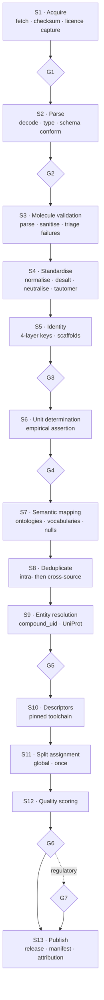

# DrugSim — Phase 1, Step 8
## Data Cleaning & ETL Pipeline

**Document status:** Draft for approval
**Date:** 2026-08-05
**Depends on:** Steps 1–7 (approved)
**Extends:** Step 2 §4 (validation gates) and §8 (curation specification)

---

## 0. What This Step Adds

Step 2 defined the six gates and the curation contract. This step specifies the **operational detail of each stage** — the algorithms, the decision rules, and the failure taxonomy — and adds four things that were not covered:

- The **empirical unit-determination protocol** (§5), forced by TDC's missing documentation
- **Conflicting-measurement resolution** (§3.3) — Step 2 said "never average in place" but did not say what models consume instead
- **Golden-set regression testing** (§10) — the mechanism that catches silent pipeline breakage
- **Measurement quality scoring** (§9)

---

## 1. Stage Map



Every stage is **idempotent** and **replayable from Z1**. Re-running the pipeline on unchanged input must produce byte-identical output; this is asserted in CI (§10.2), not assumed.

---

## 2. Stages S1–S5: Acquisition through Identity

### S1 — Acquire
Fetch per `registry.yaml`; compute SHA-256; write to `z1-landing/{tier}/{source}/{snapshot_id}/`; record `ingestion_snapshot`.

**Licence-change detection.** Compare the fetched licence statement against `data_source.license_spdx`. A mismatch halts the pipeline and raises for human review (LC-04). A source that relicenses is a material commercial event, and discovering it six months later — after models have trained on the data — is the failure mode this prevents.

### S2 — Parse
Decode to Parquet with a pinned expected schema. Column additions are permitted and logged; **removals, renames and type narrowing fail the batch** (G2). Silent type coercion is forbidden — a numeric column arriving as text fails rather than being cast, because the cast usually means the source changed something meaningful.

### S3 — Molecule validation
Failure taxonomy, each routed differently rather than lumped into "invalid":

| Failure | Example | Action |
|---|---|---|
| Unparseable SMILES | Syntax error, truncation | Quarantine, report to source curator |
| Sanitisation failure | Kekulisation failure, bad aromatic ring | Quarantine with the RDKit error |
| Valence error | 5-valent carbon | Quarantine |
| Disconnected, no dominant fragment | True mixture | Flag `is_mixture`, exclude from descriptors (Step 4 §2.2) |
| Inorganic / metal-containing | Platinum complexes | Flag; descriptors unreliable, do not silently compute |
| Polymer / undefined repeat | Markush, `*` atoms | Exclude — outside DrugSim's scope |
| Very large | MW > 2000 | Flag; outside applicability domain of every ADMET model |
| Radical / isotope | Deuterated analogues | Flag, retain — deuteration is a legitimate design strategy |

**Quarantine is not deletion.** Failed records land in a quarantine table with the reason, remain queryable, and are re-evaluated on pipeline upgrades. A parse failure is often a pipeline bug, not bad data.

### S4 — Standardise
Fixed order (Step 2 §8.1), version-pinned, idempotent:

1. Sanitise → 2. Normalise functional groups (ChEMBL Structure Pipeline) → 3. Remove explicit H, re-perceive aromaticity → 4. Strip salts/solvates → 5. Neutralise charges → 6. Canonical tautomer (stored separately) → 7. Preserve stereochemistry, flag undefined → 8. Compute identity layers

**Salt stripping edge cases**, each with an explicit rule rather than a default:

| Case | Rule |
|---|---|
| Single component | No stripping |
| Parent + known counter-ion | Strip counter-ion; record in `standardization_flags` |
| Two organic components, both drug-like | **Do not strip.** Flag `is_mixture` |
| Entire molecule is on the salt list (e.g. the drug *is* sodium chloride) | **Do not strip to nothing.** Retain original |
| Metal coordination complex (cisplatin) | Do not strip; flag as inorganic |
| Ambiguous — largest fragment heuristic would apply | Flag for curator review, do not auto-resolve |

The "strip to nothing" case is a classic bug: a naive largest-fragment rule applied to a simple salt produces an empty molecule that then fails downstream with an unhelpful error.

**Tautomer handling.** The canonical tautomer is computed and stored in a *separate field*; `standardized_smiles` retains the source tautomer. Tautomer canonicalisation is convention-dependent and changes between RDKit versions — overwriting the source form makes disagreements unresolvable.

### S5 — Identity
Compute the four layers (Step 2 §5) plus Bemis-Murcko and generic scaffolds. `ck_skeleton_prefix` verifies consistency at insert.

---

## 3. Stage S8 — Deduplication

### 3.1 Intra-source
Exact `inchikey_full` match → merge into one `compound_uid`, retaining all `source_record_id` values in `compound_xref`. No information is discarded.

### 3.2 Cross-source
The ChEMBL ↔ BindingDB overlap is large (Step 1 [V]) and unhandled duplication both inflates apparent data volume and leaks across splits.

**Compound-level:** match on `inchikey_full`; fall back to `parent_inchikey` for salt-form differences.

**Measurement-level:** two records are duplicates when they share `parent_inchikey` + target accession + `endpoint_id` + `activity_type` + source reference (DOI/PMID). Shared reference is the strongest signal — it usually means both databases abstracted the same publication.

**Deduplication does not delete.** Both records are retained; a `measurement_duplicate_group` assigns them a group id and marks one as representative. Deleting would lose the provenance chain and violate P8.

```sql
CREATE TABLE measurement_duplicate_group (
    group_uid       ulid NOT NULL,
    measurement_uid ulid NOT NULL,
    license_tier    license_tier_t NOT NULL,
    is_representative BOOLEAN NOT NULL,
    match_basis     TEXT NOT NULL CHECK (match_basis IN
        ('shared_reference','identical_value','parent_structure_target_endpoint')),
    PRIMARY KEY (measurement_uid, license_tier),
    FOREIGN KEY (measurement_uid, license_tier)
        REFERENCES measurement (measurement_uid, license_tier) ON DELETE RESTRICT
);
CREATE UNIQUE INDEX uq_dup_representative ON measurement_duplicate_group (group_uid)
    WHERE is_representative;
```

**Licence consequence:** when a duplicate group spans licence tiers — the same value present in both amber BindingDB-curated and red ChEMBL-derived data — the representative should be chosen from the **least restrictive tier available**. This is a free reduction in ShareAlike exposure and costs nothing scientifically, since the values are identical.

### 3.3 Conflicting measurements — resolution policy

Step 2 said conflicting values are never averaged in place. That is correct for storage but leaves the question models must answer: *which value do I train on?*

**Resolution is a recorded, versioned decision at training-set construction time — not a curation step.**

```sql
CREATE TABLE measurement_aggregate (
    aggregate_uid   ulid PRIMARY KEY,
    compound_uid    ulid NOT NULL REFERENCES compound(compound_uid) ON DELETE RESTRICT,
    endpoint_id     TEXT NOT NULL REFERENCES endpoint(endpoint_id) ON DELETE RESTRICT,
    target_uid      ulid REFERENCES target(target_uid) ON DELETE RESTRICT,
    aggregated_value NUMERIC(14,6) NOT NULL,
    aggregation_method TEXT NOT NULL CHECK (aggregation_method IN
        ('single_value','median','geometric_mean','max_confidence','most_recent','curator_selected')),
    n_source_measurements SMALLINT NOT NULL CHECK (n_source_measurements > 0),
    value_spread_log10 NUMERIC(8,4),
    is_discordant   BOOLEAN NOT NULL,
    aggregation_policy_version TEXT NOT NULL,
    license_tiers_consumed license_tier_t[] NOT NULL,
    CONSTRAINT uq_aggregate UNIQUE (compound_uid, endpoint_id, target_uid, aggregation_policy_version)
);
```

**Default policy v1:**
- Continuous potency (IC50/Ki/Kd): **geometric mean** of uncensored values — potency is log-normally distributed, so the arithmetic mean is the wrong central tendency
- Other continuous: **median** (robust to outliers)
- Binary: **majority vote**; ties → `is_discordant = TRUE`, excluded from training
- `value_spread_log10 > 1` (>10× disagreement) → `is_discordant = TRUE`

**Discordant records are excluded from training but retained and surfaced.** A compound with 100-fold disagreement between two labs is not a training example; it is a data-quality finding. Silently averaging it produces a confident label for a quantity nobody actually knows.

---

## 4. Stage S7 — Missing Data

**Rule 1 — Labels are never imputed.** Not by mean, not by model, not by nearest neighbour. An imputed label is a prediction wearing a measurement's clothes, and training on it teaches the model its own biases while corrupting every downstream metric. This is non-negotiable and enforced by `evidence_type <> 'predicted'` on `measurement` (Step 3).

**Rule 2 — Features may be imputed, with the method recorded.** Descriptors are computed, so they are rarely missing; when a descriptor legitimately cannot be computed (inorganic, mixture), the model must handle missingness explicitly — via an indicator variable or a model type that supports it natively — rather than receiving a silent zero. A zero is a *value*, and zero TPSA is chemically meaningful.

**Rule 3 — The three null states never collapse** (Step 2 §8.4): `not_measured`, `below_loq`, and measured-as-zero are distinct and encoded via `measurement_status`.

**Rule 4 — Censored data is preserved, not coerced.** `>10000 nM` is not `10000 nM`. Censored records are either handled with censoring-aware methods (Tobit regression, survival models) or excluded — never silently converted. Rule UV-06 enforces this. Coercing censored potency values is one of the most common sources of systematic bias in public ADMET models.

---

## 5. Stages S6 / G4 — Empirical Unit Determination

Verified 2026-08-05: **TDC does not document units** for most ADME/Tox endpoints. Documentation-based unit assignment is therefore impossible for the primary ADMET training source, and this protocol replaces it.

**Protocol, per endpoint, in order:**

**Step A — Range assertion.** Compare observed min/median/max against `endpoint.expected_min/max`. A logS array centred near −2.6 is consistent with log₁₀(mol/L); one centred near 10⁻³ indicates raw mol/L.

**Step B — Distribution shape.** Log-scaled quantities are approximately symmetric; linear-scale concentration data is strongly right-skewed. Skewness > 2 on a putatively log-scaled endpoint indicates a scale error.

**Step C — Cross-source triangulation.** Join on `inchikey_full` against ChEMBL, which documents nM and pChEMBL [V]. Compounds present in both must agree within tolerance after conversion. This is the strongest test and the only one that can detect a *consistent* unit error that passes range checks.

**Step D — Reference compound assertion.** A fixed panel of well-characterised compounds with literature-established values. Caffeine logS, propranolol logD, terfenadine hERG IC50. Deviation beyond tolerance fails the batch.

**Step E — Sign convention (mandatory for directional endpoints).** Assert that known-toxic reference compounds rank as toxic. **This is the only test that catches an LD50 sign inversion** — distribution and range checks all pass on inverted data, because the distribution is symmetric under the transformation. Step 2 §G.1 flagged this as the highest-risk conversion in the system.

Only when a method succeeds is `unit_verified_method` set away from `'unverified'`. G6 blocks publication otherwise (UV-05).

**If all methods fail**, the endpoint is ingested with `unit_verified_method = 'unverified'` and is **excluded from model training** until resolved manually. An unusable endpoint is better than a confidently wrong one.

---

## 6. Stage S10 — Descriptor Generation

Computed under a pinned `descriptor_spec_version`; results keyed `(compound_uid, descriptor_spec_version)` per Step 3 R2.

**Determinism requirements:**
- No conformer generation without a fixed seed (Step 4 §5, enforced by `ck_conformer_seed_required`)
- Single-threaded, or thread-count-independent — some RDKit descriptors have shown ordering sensitivity under parallelism
- Descriptor set and order recorded in `descriptor_spec.descriptor_list`

**On toolchain upgrade:** compute a *new* `descriptor_spec_version`. Never overwrite. Existing models continue to reference their original spec, remaining reproducible; new models opt in explicitly.

---

## 7. Stage S11 — Split Assignment

Runs once, globally, over the union of all compounds (ADR-009). `is_frozen = TRUE` blocks reassignment; IN-03 asserts stability against the previous release.

**New compounds in a later release** are assigned to their scaffold's existing group where the scaffold is known, and hashed into a group where it is new. Existing assignments never change — which is precisely why `uq_scaffold_single_group` exists.

---

## 8. Stage S13 — Publication & Version Tracking

Publication produces:
1. `drugsim_release` row with SemVer (Step 2 §7.2)
2. Release manifest: every `snapshot_id`, `toolchain_id`, `descriptor_spec_version`, row counts per table, gate results
3. Regenerated attribution manifest (LC-05)
4. Diff report against the previous release: row deltas, new/removed sources, licence changes, value changes on existing records

**A value change on an existing record forces a MAJOR bump** (Step 2 §7.2), even when it originates from an upstream re-curation rather than our code. Models trained on the prior release are not valid against the new one without re-validation, and the version number must say so.

---

## 9. Measurement Quality Scoring

A composite used to weight training data and to rank evidence.

| Component | Weight | Basis |
|---|---|---|
| Source curation level | 0.25 | Manual (ChEMBL, BindingDB-curated) > automated > text-mined |
| Assay confidence | 0.20 | ChEMBL `confidence_score` 0–9, rescaled |
| Replication | 0.15 | `n_replicates`, `std_error` present |
| Concordance | 0.15 | Agreement with other sources; penalised if `is_discordant` |
| Guideline compliance | 0.15 | OECD TG / GLP flags where applicable |
| Provenance completeness | 0.10 | Reference DOI/PMID present, unit verified |

**Weights are provisional and versioned** (`quality_score_formula_version`). They are a reasonable prior, not an empirically fitted model — that requires Phase 3 performance data. Stating them as provisional is more useful than presenting invented precision.

---

## 10. Quality Assurance

### 10.1 Golden set regression
A frozen set of ~500 reference compounds with hand-verified expected outputs: standardised SMILES, all four identity keys, descriptors, rule verdicts, and unit-converted values for a subset of endpoints.

**Every pipeline change runs the golden set and diffs against expected.** Any difference must be either explained and the expectation updated with a recorded reason, or treated as a regression. This is the primary defence against silent breakage — the failure mode where a standardisation tweak subtly changes 400,000 structures and nobody notices for two releases.

The golden set deliberately includes hard cases: multi-component salts, tautomer pairs, undefined stereocentres, metal complexes, zwitterions, deuterated analogues, and at least one compound per identified salt-stripping edge case (§S4).

### 10.2 Idempotency assertion
CI asserts `f(f(x)) == f(x)` for the standardisation pipeline on the golden set. Non-idempotent standardisation causes structures to drift across releases — slowly, invisibly, and irreversibly.

### 10.3 Statistical process control
Per release, compare against the previous: row counts by table and source, descriptor distributions (KS test), class balance per endpoint, null rates, duplicate rates. Deviation beyond threshold raises for review. Not automatic failure — legitimate large changes happen — but never silent.

### 10.4 Cross-source consistency monitoring
Ongoing agreement rate between ChEMBL and BindingDB on overlapping measurements. A declining rate signals a standardisation or unit-conversion regression before it reaches models.

---

*End Step 8.*
