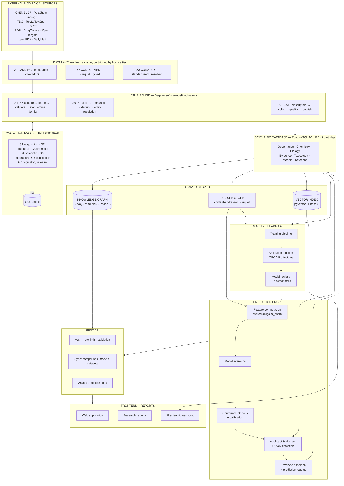
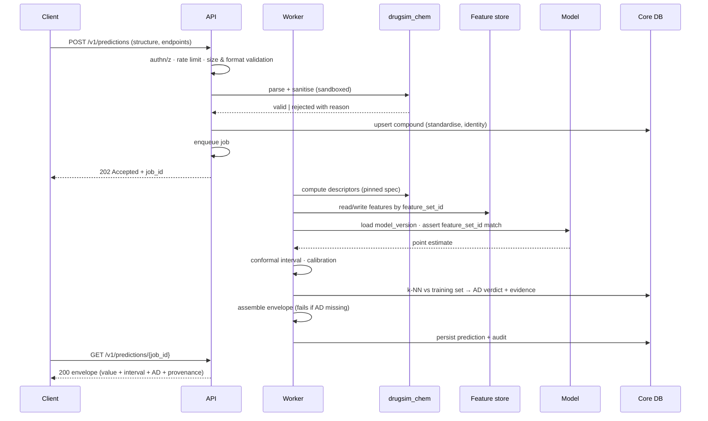

# TDS §2 — System Architecture

**Consolidates and extends:** Phase 1 Step 2 (data architecture), Step 9 (knowledge graph), Step 10 (stack)

---

## 2.1 Full-Stack Architecture



---

## 2.2 Component Reference

### Layer 1 — External sources
Eleven Tier 1/2 sources selected in Phase 1 Step 1 with verified licences and record counts. Governed declaratively by `datasets/registry.yaml`; nothing enters the lake without a registry entry.

**Boundary contract:** sources are read-only, untrusted, and may change without notice. The pipeline assumes schema drift, licence changes and quality variation, and fails loudly on each rather than absorbing them.

### Layer 2 — Data lake
Three immutable zones on S3-compatible object storage, each partitioned by licence tier.

| Zone | Content | Mutability |
|---|---|---|
| Z1 Landing | Bytes exactly as retrieved | Write-once, object-lock, permanent retention |
| Z2 Conformed | Parsed to Parquet; **no semantic change** | Rebuilt from Z1 |
| Z3 Curated | Standardised, resolved, deduplicated, unit-harmonised | Rebuilt from Z2 |

**Why Z2 exists separately from Z3:** when a curated value looks wrong, Z2 answers whether the source said it or we broke it. Collapsing them removes the only diagnostic that distinguishes an upstream problem from our own.

**Why the lake exists at all** at this data scale: replayability, not capacity. Upstream sources mutate; our Z1 snapshot is the reproducibility guarantee, which makes its retention a scientific requirement rather than a storage-cost decision.

### Layer 3 — ETL pipeline
Thirteen stages across three groups (Phase 1 Step 8 §1), orchestrated by Dagster as software-defined assets so lineage is structural rather than documented. Every stage is idempotent and replayable from Z1; CI asserts `f(f(x)) == f(x)` on the golden set.

### Layer 4 — Validation layer
Seven gates, each a **hard stop**. Failure quarantines the batch and raises; there is no warn-and-continue path, because warn-and-continue is how bad data reaches models.

G4 (semantic) deserves specific mention: because TDC does not document units for most ADME/Tox endpoints (verified 2026-08-05), unit correctness is asserted **empirically** — range, distribution shape, cross-source triangulation, reference compounds, and sign-convention checks. G7 runs only for regulatory releases.

**Quarantine is not deletion.** Failed records remain queryable with their failure reason and are re-evaluated on pipeline upgrades, because a parse failure is more often a pipeline bug than bad data.

### Layer 5 — Scientific database
PostgreSQL 16 with the RDKit cartridge; ~35 tables across seven domains (Phase 1 Step 3, extended in Steps 4–8). System of record for facts, provenance, governance and predictions.

The cartridge is the decisive capability: substructure (`@>`) and Tanimoto (`%`) search with GiST indexes, in SQL, over ~3M compounds. `measurement` is LIST-partitioned by `license_tier`, making the licence audit a partition scan and allowing black-tier data to be isolated wholesale.

### Layer 6 — Knowledge graph
Neo4j, **read-only, rebuilt per release, one-way from Postgres**. Deferred to Phase 6 and adopted only if a named module requires it (ADR-004); in-memory `igraph` is the recommended first step.

Justified by four capabilities SQL cannot serve: variable-depth mechanism paths, guilt-by-association target prediction, repurposing path discovery, and graph embeddings for link prediction.

### Layer 7 — Feature store
Content-addressed Parquet keyed by `compound_uid`:

```
feature_set_id = sha256(descriptor_spec_version ‖ rdkit_version ‖
                        standardization_pipeline_version ‖ sorted(descriptor_names))
```

**RDKit descriptor values change between releases.** Without `rdkit_version` in the feature identity, models silently drift and results stop being reproducible. This is a real, frequently-encountered failure, not a theoretical one.

### Layer 8 — Machine learning
Training and validation as Dagster assets; artefacts in object storage; metadata in the Core DB (`model`, `model_version`, `model_validation_record`, `model_qmrf`). Full treatment in §6.

### Layer 9 — Prediction engine
Five stages, in fixed order. Two properties matter architecturally:

1. **Feature computation uses the same `drugsim_chem` library as training.** Not an equivalent implementation — the same one. This is the structural prevention of training/serving skew, and `feature_set_id` mismatch is a hard error, not a warning.
2. **Uncertainty stages are not bypassable.** Conformal intervals and AD assessment sit between inference and response assembly, and the envelope cannot be constructed without them.

### Layer 10 — REST API
Split by execution profile: synchronous for retrieval, **asynchronous job-based for prediction**. Rationale in §5.

### Layer 11 — Frontend and reports
Web application, report generation, and an AI assistant grounded in DailyMed and literature via `pgvector`. The design constraint carried from §1.4: it must be impossible to render a prediction without its uncertainty, enforced by contract tests the frontend must pass (§5.9).

---

## 2.3 Boundaries and Contracts

Clear boundaries are what let a five-year project survive team turnover.

| Boundary | Contract | Stability |
|---|---|---|
| External sources → Z1 | `registry.yaml`; untrusted input | Volatile; assume drift |
| Z3 → Core DB | Curated schema + gate results | Changes with Core DB MAJOR |
| Core DB → feature store | `compound_uid` + `descriptor_spec_version` | Stable; additive only |
| Core DB → KG | One-way projection, rebuilt per release | Derived; no reverse writes |
| Model registry → prediction engine | `model_version` + `feature_set_id` | Immutable per version |
| Prediction engine → API | **Prediction envelope** (§4.3) | Versioned independently of DB schema |
| API → frontend | OpenAPI contract, `/v1/` | Breaking changes require a new version path |

**The most important line is between the internal schema and the API contract.** The Core DB has ULIDs, licence tiers, audit columns and partition keys — none of which belong in a public response. Coupling them would make every schema refactor a breaking API change. §4 defines the contracts as a separate, deliberately narrower surface.

---

## 2.4 Data Flow — Prediction Request



**Two failure points are deliberate.** Structure parsing rejects at the boundary with a specific reason rather than accepting and failing later. Envelope assembly fails hard if AD is absent, so an incomplete prediction is never returned.

---

## 2.5 Deployment Topology (Phase 2 target)

```
┌───────────────────────────────────────────────────────┐
│ Load balancer (TLS termination)                       │
└───────────────────────────────────────────────────────┘
        │                              │
┌───────────────┐            ┌─────────────────────┐
│ API service   │            │ Web application     │
│ (stateless,   │            │ (static + SSR)      │
│  2+ replicas) │            └─────────────────────┘
└───────────────┘
        │ enqueue
┌───────────────────────────────────────────────────────┐
│ Job queue                                             │
└───────────────────────────────────────────────────────┘
        │
┌───────────────┐   ┌────────────────┐   ┌─────────────┐
│ Prediction    │   │ ETL workers    │   │ Dagster     │
│ workers (N)   │   │ (batch)        │   │ daemon      │
└───────────────┘   └────────────────┘   └─────────────┘
        │                   │                   │
┌───────────────────────────────────────────────────────┐
│ PostgreSQL 16 + RDKit  (primary + replica)            │
│ Object storage (lake · features · model artefacts)    │
└───────────────────────────────────────────────────────┘
```

Stateless API and workers scale horizontally; Postgres is the single stateful component and the primary scaling consideration. Given the data volumes verified in Phase 1, vertical scaling plus a read replica is sufficient well beyond initial needs.

---

*End §2.*
