# TDS §6 — Machine Learning Architecture

**Architecture only. No model implementation.**

---

## 6.1 Constraints That Shape This Design

Phase 1 verified the training corpus. Three consequences drive every decision below.

| Fact | Consequence |
|---|---|
| ADMET datasets are **475–13,130 compounds** | Small-data regime. Uncertainty quantification is not an enhancement — it is the deliverable. Deep architectures needing large data are largely inapplicable |
| Cross-dataset scaffold leakage inflates metrics | Global `split_group`, assigned once (ADR-009). Reported numbers will be lower than leaderboards, and both must be published |
| RDKit descriptor values change between releases | `feature_set_id` content-addressing; a mismatch between training and serving is a **hard error** |

A fourth, from the regulatory decision: **a retrained model is a change-controlled event requiring revalidation**, not a deployment. Retraining is not free, and the architecture must not encourage casual retraining.

---

## 6.2 Pipeline Overview

```mermaid
flowchart LR
    subgraph TRAIN["Training — Dagster assets"]
        A["Select training set<br/>Core DB + split_group"] --> B["Materialise features<br/>feature_set_id"]
        B --> C["Fit model<br/>seeded, deterministic"]
        C --> D["Fit conformal calibrator<br/>on held-out calibration split"]
        D --> E["Fit AD definition"]
    end
    subgraph VALID["Validation"]
        F["Global-split test"] --> G["Benchmark-split test"]
        G --> H["y-scrambling"] --> I["OECD 5-principle records"]
        I --> J["QMRF"]
    end
    subgraph REG["Registry"]
        K["Artefact → object storage<br/>sha256-addressed"] --> L["model_version row<br/>immutable"]
    end
    subgraph SERVE["Inference"]
        M["drugsim_chem<br/>SAME library as training"] --> N["Load by alias<br/>champion / challenger"]
        N --> O["assert feature_set_id match"]
        O --> P["Predict"] --> Q["Conformal interval"]
        Q --> R["AD + OOD"] --> S["Envelope + log"]
    end
    E --> F
    J --> K
    L --> N
```



---

## 6.3 Training Pipeline

**Implemented as Dagster software-defined assets**, so lineage from Core DB release → training set → features → model is structural rather than documented.

### 6.3.1 Training-set selection
A recorded, reproducible query — never an ad-hoc extract:

```
FROM measurement_aggregate
WHERE endpoint_id = :endpoint
  AND aggregation_policy_version = :policy
  AND NOT is_discordant                    -- Phase 1 Step 8 §3.3
  AND value_relation = '='                 -- censored handled separately
JOIN compound_split_assignment USING (compound_uid)
WHERE split_group IN :train_groups
```

Recorded on the model version: `training_snapshot_id`, `aggregation_policy_version`, split groups used, and `training_license_tiers` — the last of which drives `is_commercial_ok` automatically (Phase 1 Step 3 §7.1), so commercial shippability is computed, never asserted.

**Censored records** (`value_relation ≠ '='`) are excluded by default. Including them requires a censoring-aware method and an explicit flag; silent coercion of `>10000 nM` to `10000 nM` is a known systematic bias and is blocked by rule UV-06.

### 6.3.2 Determinism
Every training run pins: random seeds (framework, numpy, CUDA where used), `toolchain_id`, `feature_set_id`, library versions via lockfile, and data via `training_snapshot_id`.

**Bit-identical reproducibility is asserted in CI** for at least one reference model per algorithm family. Where a framework cannot guarantee bitwise determinism (some GPU kernels), that is recorded on the model version as `determinism: statistical` with a tolerance, rather than left implicit — an honest statement of the limit is worth more than an unverifiable claim.

### 6.3.3 Split allocation
Ten global `split_group` values (0–9), allocated per model version and recorded:

| Purpose | Typical | Note |
|---|---|---|
| Train | groups 0–6 | |
| Calibration | group 7 | **Reserved for conformal calibration only** |
| Validation | group 8 | Hyperparameter selection |
| Test | group 9 | Touched once, at the end |

**The calibration split is not reused for training or validation.** Split conformal prediction's coverage guarantee depends on the calibration set being exchangeable with test data and unseen by the model; reusing it silently voids the guarantee while still producing plausible-looking intervals.

This costs ~10% of already-scarce data. Accepted: an interval with a valid guarantee is worth more than a slightly better point estimate with an invalid one.

---

## 6.4 Validation Pipeline

Structured on the **OECD five principles**, one `model_validation_record` row per principle (Phase 1 Step 3 §7.2), so "which principles are unsatisfied?" is a query.

| Principle | Evidence produced |
|---|---|
| 1. Defined endpoint | `endpoint` registry entry: canonical unit, species, protocol, `higher_is_worse` |
| 2. Unambiguous algorithm | Algorithm, hyperparameters, `feature_set_id`, code SHA, container digest |
| 3. Applicability domain | AD method, parameters, empirical coverage of the AD definition |
| 4. Goodness-of-fit, robustness, predictivity | Internal CV · external test on group 9 · **y-scrambling** · bootstrap CIs |
| 5. Mechanistic interpretation | Feature importance, structural alert correspondence, AOP linkage where applicable |

**y-scrambling is required, not optional.** Permuting labels and retraining must collapse performance to chance. A model that performs well on scrambled labels is fitting an artefact — a leak, a duplicate, or a confounded descriptor. On datasets of a few hundred compounds this is a realistic failure, and it is the cheapest way to detect it.

### 6.4.1 Dual-split reporting
Both regimes are computed and both are published (§4.4.1):

- **Global split** — internal truth, leakage-controlled, the number used for decisions
- **Benchmark split** (TDC canonical) — leaderboard comparability

The gap between them is itself a reported quantity. A large gap indicates the endpoint's public benchmark is substantially inflated by cross-dataset leakage — useful information for the field, and for our own honesty.

### 6.4.2 Promotion gates
A model reaches `champion` only if: all five OECD records present and satisfied · global-split performance ≥ the endpoint's threshold · y-scrambling collapses to chance · conformal coverage within tolerance · AD defined and validated · QMRF complete · **no black-tier data in training**.

---

## 6.5 Model Registry & Versioning

**Metadata in the Core DB** (`model`, `model_version`, `model_validation_record`, `model_qmrf`); **artefacts in object storage**, addressed by `sha256`.

| Property | Rule |
|---|---|
| Immutability | A `model_version` row is never updated after promotion, except `status` |
| Artefact integrity | `artifact_sha256` verified on load; mismatch is a hard failure |
| Versioning | SemVer. **MAJOR** = training data or algorithm change; **MINOR** = hyperparameters/retrain on same data; **PATCH** = packaging only |
| Serving | By **alias**, not version. `champion`, `challenger`, `shadow` |
| Status | `development` → `challenger` → `champion` → `deprecated` → `withdrawn` |

**Alias-based routing is what makes rollback instant.** The inference layer resolves `champion` at request time; promotion and rollback are alias updates, not deployments. No container rebuild, no traffic drain.

### 6.5.1 Experiment tracking — **MLflow**
Self-hosted, Apache-2.0, backed by the same Postgres. Tracks runs, parameters, metrics and artefacts during development.

**MLflow is not the system of record.** Promoted models are registered in the Core DB, which carries the constraints, audit trail and licence lineage MLflow lacks. MLflow is the exploration log; the Core DB is the regulatory record. Conflating them would put validation evidence in a system with no audit guarantees.

---

## 6.6 Inference Pipeline

Five ordered stages; none skippable.

**1. Feature computation** — via `src/drugsim_chem`, the identical library used in training. Not a port, not a reimplementation. Enforced by CODEOWNERS and by stage 3.

**2. Model load** — resolve alias → `model_version`; verify `artifact_sha256`; cache in worker memory.

**3. Feature-set assertion** — `prediction.feature_set_id` must equal `model_version.feature_set_id`. **Mismatch raises and fails the request.** This is the structural prevention of training/serving skew (R6); it must never be downgraded to a warning, because a warning in this position means silently wrong predictions at scale.

**4. Uncertainty** — conformal interval (§6.7) and AD assessment (§6.8).

**5. Envelope assembly** — fails if `reliability` is incomplete. An incomplete prediction is never returned.

### 6.6.1 Prediction logging
Every prediction persists to `prediction` with full provenance, plus an audit entry. Logged: compound reference, endpoint, estimate, interval, AD verdict and evidence, model/feature/snapshot identifiers, quality score, timestamp, requesting user and tenant.

**Never logged: the structure itself in application logs** (§7, P11). The compound is referenced by `compound_uid`; the structure lives only in the tenant-scoped database row.

---

## 6.7 Confidence Estimation

**Primary method: split (inductive) conformal prediction.**

Chosen because it provides distribution-free, finite-sample validity under exchangeability — a *guarantee*, not a heuristic. On datasets of a few hundred compounds, methods relying on asymptotic behaviour or ensemble spread give confidence numbers with no coverage property at all. Conformal also degrades honestly: an unfamiliar molecule yields a wide interval rather than a confident wrong answer.

| Task | Method | Output |
|---|---|---|
| Regression | Split conformal on the calibration group | Interval at nominal coverage (default 90%) |
| Regression, heteroscedastic | Normalised/Mondrian conformal | Locally adaptive width |
| Classification | Venn-Abers or Mondrian conformal | Calibrated probability; prediction set |

**Empirical coverage is validated, not assumed.** For each model, observed coverage on the held-out test group must fall within tolerance of nominal. A 90% interval covering 62% of test values is a broken model, and this check is a promotion gate (§6.4.2).

**A known consequence, stated rather than engineered around:** on the smallest endpoints, valid intervals may be so wide that they appear unhelpful. That is the true state of the evidence. Narrowing them by abandoning the guarantee would substitute a comfortable number for an honest one — the opposite of what a triage product is for.

---

## 6.8 Applicability Domain

No single AD method is reliable; DrugSim combines three and reports the components.

| Method | Signal | Threshold |
|---|---|---|
| **Max Tanimoto to training set** | Structural novelty | < 0.4 → strong OOD signal |
| **k-NN distance in descriptor space** | Descriptor-space novelty | > 95th percentile of training distances |
| **Scaffold seen in training** | Chemotype familiarity | Boolean |
| *(supporting)* Conformal interval width | Model's own uncertainty | > 2× median training-set width |

**Verdict logic**

| Verdict | Condition |
|---|---|
| `in_domain` | Tanimoto ≥ 0.6 **and** k-NN distance within range |
| `borderline` | Exactly one strong indicator triggered |
| `out_of_domain` | Two or more triggered, or Tanimoto < 0.4 |
| `undeterminable` | Descriptors uncomputable (mixture, inorganic) |

Thresholds are **per-endpoint and calibrated empirically**, not universal constants — an endpoint covering narrow chemistry warrants stricter bounds than one covering diverse space. Recorded in `model_version.ad_definition`.

`ad_rationale` renders the reasoning in plain language: *"Maximum similarity to any training compound is 0.21; scaffold not present in training set."* A chemist can evaluate that; a bare label they cannot.

---

## 6.9 OOD Detection Beyond AD

AD asks "is this within the model's competence?". OOD detection asks the broader question of whether the input belongs to the modelled population at all.

| Check | Response |
|---|---|
| Molecular weight far outside training range | Warning; may force `out_of_domain` |
| Element not present in training data (e.g. boron, platinum) | Force `out_of_domain` — descriptors are extrapolating on chemistry never seen |
| Structural class absent from training (macrocycle, PROTAC) | Warning; flagged for review |
| Descriptor vector Mahalanobis distance beyond threshold | Contributes to verdict |

**Novel-element detection matters more than it appears.** A model trained entirely on C/H/N/O/S/halogen chemistry has no basis for a boron-containing compound, yet descriptors compute without error and the model returns a confident-looking number. There is no signal in the value itself; only an explicit check catches it.

---

## 6.10 Rollback Strategy

| Scenario | Action | Time |
|---|---|---|
| Model performing poorly in production | Re-point `champion` alias to the prior version | Seconds |
| Bad feature spec deployed | Roll back `descriptor_spec_version`; affected predictions flagged for recompute | Minutes |
| Core DB release found faulty | Restore prior release; models pinned to `training_snapshot_id` remain valid | Hours |
| Systematic prediction error discovered | Mark affected `prediction` rows `superseded`, notify affected tenants, recompute | Hours–days |

**Model versions are immutable and never deleted** — rollback is always available because the prior artefact still exists (P8).

### 6.10.1 Shadow and canary
New models run in **shadow** first: they receive production traffic and log predictions, but their output is not returned. Agreement with the champion, interval widths and OOD rates are compared over a defined window. Promotion to canary (a traffic percentage) follows, then champion.

Shadow mode is how a model is validated on **real query chemistry**, which typically differs from the training distribution more than any held-out split does. It is also free of user risk, which is why it precedes canary rather than replacing it.

### 6.10.2 Notification obligation
When a systematic error is found in predictions already delivered, affected tenants are notified — the prediction log makes "who received this?" a query. Under the regulatory path this may be a formal obligation; commercially it is table stakes for a platform making safety-adjacent claims.

---

## 6.11 Retraining Under Change Control

| Trigger | Response |
|---|---|
| New Core DB release with materially more data | Evaluate; retrain if justified |
| Drift detected (rising OOD rate, coverage degradation) | Investigate before retraining — drift may reflect a changing user population, not a stale model |
| Upstream data correction | Retrain; MAJOR version |
| Scheduled cadence | **Not adopted.** Retraining on a calendar with no evidence of need creates revalidation burden for no gain |

Every retraining produces a new `model_version` with a full validation cycle and, under the regulatory path, a change-control record and signature. **There is no automatic retraining and no continuous learning in production.** A model that silently changes is a model whose predictions cannot be reproduced (P1, P5) — and under Part 11 it is also an uncontrolled change.

---

*End §6.*
